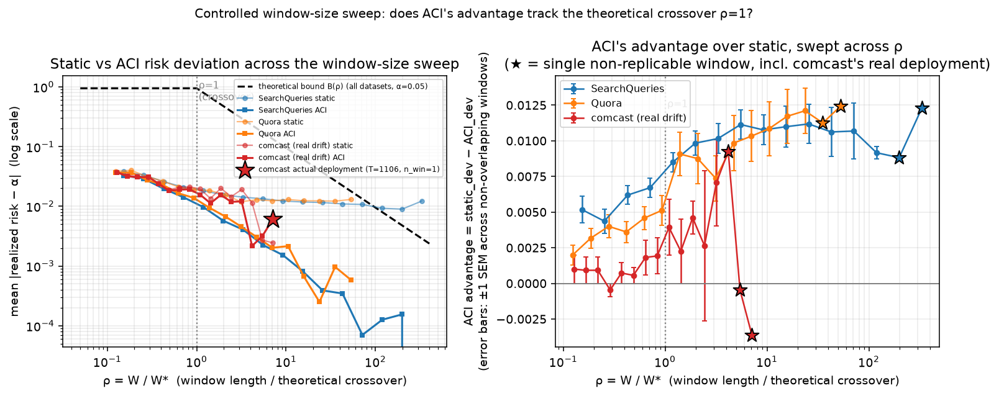

# 语义缓存复用决策的边界压力测试：不确定性信号、丢弃的相似度信号与在线自适应阈值

**作者：** 辛成友
**机构：** LoopDot AI Research
**日期：** 2026-09-08
**说明：** 本研究项目最初以一份涵盖全部实验的完整技术报告形式发布（Zenodo DOI: 10.5281/zenodo.21703364，概念 DOI，始终指向最新版本）；本文是从该项目中提炼、独立成篇的姊妹论文之一。本文是 [Xin, C. (2026). 语义缓存中的同步在线验证门禁：一项实证研究 —— 第一部分：核心发现与 Go/No-Go 判定. Zenodo. https://doi.org/10.5281/zenodo.22660442.](下称"主论文") 的姊妹论文，复用主论文的数据集、灰色地带架构与诚实校准协议。本文同时建立在 [Xin, C. (2026). 语义缓存复用决策的有限样本风险控制：形式化保证、自选择反馈环与经济性. Zenodo. https://doi.org/10.5281/zenodo.22663725.](下称"论文 B") 与 [Xin, C. (2026). 语义缓存验证器的对抗鲁棒性：红队测试暴露的缺口与训练时的部分修复. Zenodo. https://doi.org/10.5281/zenodo.22661312.](下称"论文 C") 之上。本文是目前这四篇论文里唯一同时依赖前三篇工作的一篇。
**代码与完整实验产物：** 本仓库 `scripts/aci_crc_violation_fix.py`、`scripts/aci_real_production_drift_score.py`、`scripts/aci_real_production_drift_analysis.py`、`scripts/aci_theoretical_bound_verification.py`、`scripts/aci_window_sweep_causal_test.py`、`scripts/joint_grayzone_decision_analysis_v2.py`、`scripts/joint_grayzone_doseresponse_causal_test.py`、`scripts/qcached_nli_forgetting_sweep.py`、`scripts/qcached_nli_fusion_eval.py`、`scripts/qcached_nli_fusion_cost_analysis.py`，及对应的全部 `results/*.json` 文件。

---

## 摘要

主论文证明领域内微调能修复验证器自身的判别力缺口；论文 B 给这个决策接上一个有限样本形式化风险保证（CRC）；论文 C 证明这个决策对刻意构造的对抗查询很脆弱。本文系统检验几条"不需要重新训练验证器就能榨取更多价值"的路径，并在检验过程中定位到一个比任何单一发现都更根本的问题。三条路径里，两条是负面结果：用验证器分数到阈值的距离作为不确定性信号做选择性弃权，不携带经济上可利用的结构化信息；给 CRC 保证本身设计一个逐请求的有效性门控，同样没有增量价值，真正管用的是强制重新校准周期加分布漂移告警。第三条路径是正面的：语义缓存架构从设计之初就把带请求进入灰色地带的相似度分数在验证器裁决后完全丢弃，把这个信号重新接回联合判定规则——不需要任何重新训练——在验证器判别力较弱的数据集上能显著扩大命中率/错误率前沿，一次噪声注入的剂量-反应实验因果验证了这个效应，且效应大小与验证器自身判别力呈现平滑的因果关系。把同一原理推广到候选级联的第二候选判定时，在 LmArena 上意外暴露出一个更深的问题：候选可及样本的正例率随缓存增长从 0% 剧烈爬升到 83%，任何"拟合一个静态阈值再部署"的协议在这种非平稳性下都测不准——这与本文对 CRC 有效性的独立发现，是同一枚硬币的两面。真正的解法是换成不依赖排序或阈值静态可转移这一假设的在线自适应阈值（ACI），本文为这个应用给出一个有限样本的分布无关风险控制命题（连同复用率上限由 ROC 曲线决定的推论），并用一次真实生产漂移数据上的受控实验，诚实地检验了这个理论工具能预测什么、不能预测什么——理论上界是否还有约束力，和 ACI 的经验优势有多大，是两个相关但不同的问题，本文第一次把它们分开检验。

---

## 1. 引言

主论文、论文 B、论文 C 各自回答了一个关于同步验证门禁的具体问题：机制本身有没有理论空间、能不能给它一个数学保证、这个保证对刻意构造的攻击有多脆弱。但三篇论文都建立在同一个默认设计之上——灰色地带的最终判定只看验证器一个分数，而且这个判定规则一旦校准，就假设它能在部署期间保持静态有效。本文系统检验这两个默认设计选择本身是否成立。

第一部分（4.1、4.2 节）检验能不能在不改判定规则本身的前提下，从"不确定性"这个角度榨取更多价值——用验证器分数本身的置信程度做逐请求的弃权或有效性门控。两个方向都给出负面结果，但负面结果本身指向一个共同的诊断：真正管用的补救手段是全局、周期性的（重新校准、漂移告警），不是逐请求的。

第二部分（4.3、4.4、4.5 节）检验判定规则本身的设计——只看验证器分数、丢弃相似度信号——是否留下了未兑现的价值。这条线索最终指向一个比"联合判定有没有用"更根本的问题：候选池本身的构成会随缓存增长发生剧烈的非平稳漂移，任何静态阈值协议都无法应对。

第三部分（4.6 节）给出解法：在线自适应阈值（Adaptive Conformal Inference，ACI）。本文为这个应用场景补上一个有限样本形式化命题，并诚实地用受控实验检验这个命题的诊断量能预测什么、不能预测什么——这也是全文最终的落脚点：不是发明一个新的证明技巧，而是把理论工具的适用边界和经验有效性清楚地分开。

---

## 2. 相关工作：选择性预测与在线自适应推断

本文两条独立的方法论线索，各自建立在一批此前未被主论文、论文 B、论文 C 引用过的文献之上。

**选择性预测 / 带拒绝选项的分类**（Chow, 1970；El-Yaniv & Wiener, 2010；Geifman & El-Yaniv, 2017）与 **learning-to-defer**（Cortes et al., 2016；Mozannar & Sontag, 2020）把"要不要为这条输入出预测"本身当成一个可学习、可给风险保证的决策——4.1 节的选择性弃权检验、4.2 节的 CRC validity gate 检验都直接建立在这条线上。保形化的拒绝选项有限样本保证见 Szabadváry et al.（2025）；covariate shift 下的加权保形见 Tibshirani, Foygel Barber, Candès & Ramdas（2019）——4.2 节的密度比重加权方法直接来自这条工作。

**Adaptive Conformal Inference**（Gibbs & Candès, 2021）提出在分布漂移下，用逐步观测到的真实覆盖率偏差在线修正阈值这一控制环路思想，本文 4.5、4.6 节的在线自适应阈值直接建立在这个思想之上——4.6 节给出的有限样本命题，论证手法与 Gibbs & Candès 原论文自己的有限样本论证同属一类，本文不主张这是一个全新的证明技巧，真正的贡献是把这套论证具体应用到本文的 threshold-space 场景，并提炼出一个可在部署前直接计算的窗口尺度诊断量。

---

## 3. 实验设置（复用主论文、论文 B、论文 C，本节仅作必要复述）

本文全部实验复用主论文的三个数据集（SemCacheLMArena、SemCacheSearchQueries、Quora Question Pairs）、灰色地带架构（τ_low=0.80、τ_high=0.97）与诚实校准协议（时间顺序切分 + Youden's J）。4.1、4.2 两节额外复用论文 B 4.1 节（CRC）与 4.3 节（成本比框架）的具体机制；4.3 节复用论文 C 已生成的对抗留出集与训练三元组。4.6 节额外使用一个真实生产客服流量数据集——comcastcares，一个跨越多年的真实 Twitter 客服品牌，其构造与灰色地带正例率的非平稳性诊断见主论文。

---

## 4. 结果

### 4.1 验证器分数到阈值的距离,是不是关于"该不该信任这次判定"的可用信号——一次对选择性弃权的负面检验

**动机**:本文其余部分的门禁在灰色地带永远是二元的(serve 或 miss)。一个自然的补强:在灰色地带里再切出一个弃权带,`s ≥ θ+w_hi` → serve,`s ≤ θ−w_lo` → miss,落在 `[θ−w_lo, θ+w_hi]` 里 → 交给一个更强的 oracle(真实 LLM judge)按其判定。选择性预测文献——带拒绝选项的分类(Chow, 1970;El-Yaniv & Wiener, 2010;Geifman & El-Yaniv, 2017)和 learning-to-defer(Cortes et al., 2016;Mozannar & Sontag, 2020)——给了这套做法现成的分析框架,一份外部评估也把它排为最值得做的下一步。但要小心把研究问题框对:oracle 若完美,"弃权能不能帮"是废话;真问题是**验证器自己的打分是否携带关于"这次判定该不该信任自己"的、可被经济利用的结构化信息**。经两轮内部审查收窄成一句可证伪的表述:

> **验证器分数到决策阈值的距离(`|s−θ|`),是否比随机弃权更能预测该次判定的错误倾向——使得一个很小的弃权率就能显著降低端到端错误率?**

若答案是否(弃权信号 ≈ 随机弃权),这是一个精确的负面结果:验证器打分不含关于决策不确定性的可用信息,项目不应继续包装三元 API。**v1 不改任何 API、不碰 `decision:"defer"`,是纯历史 trace 的 post-hoc replay**。

**方法**:灰色地带每条请求,验证器给分 `s`。四个信号:(a) 原始分数裕度 `|s−θ|`(零成本);(b) 校准概率距离 `|p−0.5|`(校准半段上拟合 isotonic);(e) **随机弃权(下界锚)**——(a)/(b) 必须显著跑赢它;(f) **oracle-informed 弃权(上界锚)**——直接用 ground truth 弃权掉"验证器会判错"的那些,衡量任何真实信号还剩多少空间。诚实校准:每个 τ_low 的灰色地带流按时间顺序 50/50 切,θ 用 Youden's J,都在校准半段定、不看测试结果(与 主论文一致)。弃权率网格 δ ∈ {0, .02, .05, .10, .15, .20, .30, .50, .75, 1.0}(占灰色地带),每个 δ 报告在同一测试子集(scope = 全部非灰色地带请求 + 测试半段灰色地带请求)上的端到端 hit_rate / error_rate,以及**实际实现的** δ。τ_low = 0.80 主跑,0.86 / 0.92 稳健。数据集:三个 Group D(LmArena / Quora / SearchQueries 修正后,off-the-shelf 验证器 AUC 0.72 / 0.61 / ≈0.60)+ 两个 Group E(LmArena / SearchQueries 领域内微调,AUC 0.88 / 0.71)。

*oracle 不完美,解析处理不采样*:`E[命中|DEFER,标签 y] = (1−ε_fr) if y=等价 else ε_fa`。ε_oracle 实测:每数据集抽 160 对真实灰色地带匹配对(按 `|s−θ|` 分近/远两层各 80,按 `would_be_correct` 分层),DeepSeek 做等价性判定,记录 judge 判定 vs. ground truth。整个实验因此纯解析 + bootstrap,秒级完成。

*两个预注册主统计量*:

- **P1(有没有结构)**:`κ = (A_signal − A_random) / (A_oracle_informed − A_random)`,`A_·` 是各信号在 error-vs-实现δ 曲线下、δ ∈ [0, 0.30](预注册上限,理由:小弃权率是唯一有产品意义的区间)的面积。嵌套 bootstrap CI(重采样测试记录 × 从 ε_oracle 的 judge 调用拟合的 Beta 抽 ε)。κ≈0 → 无可利用结构;κ≈1 → 要警惕(分数几乎完美识别自己的错误 → 可能根本不需要 oracle,换个 θ 就够)。
- **P2(经济上值不值)**:`cost(r, c_j, δ) = r·error_rate(δ) + (1−hit_rate(δ)) + c_j·oracle_call_rate(δ)`,`r = C_false_accept / C_miss`(论文 B §4.3),`c_j = C_judge / C_miss`。在 `(r, c_j)` 网格(r ∈ {0.5, 1, 2, 5, 10, 20, 50},c_j ∈ {0.3, 0.7})上看 `argmin_δ cost` 是否 > 0,且是否打赢 **δ=0 @ 成本最优单阈值**——不是 δ=0 @ Youden's J。论文 B §4.3 已证 Youden's J ≠ 成本最优操作点,拿 deferral 比一个本来就没调好的单阈值,会把"换个 θ 就能免费拿回、根本不需要 oracle"的收益错记成 deferral 的功劳。所以问题精确表述为:**deferral vs. 一个已经按成本调到最好的单阈值**。

**结果——三层证据,全部指向负面**:

*第一层:真实 oracle 在弃权样本上系统性过度拒绝,而且多数拒得对。*ε_oracle 实测(近-θ 层):

| 数据集 | ε_fa(judge 误接受) | ε_fr(judge 过度拒绝) |
|---|---|---|
| LmArena | 0.075 | 0.600 |
| Quora | 0.000 | 0.975 |
| SearchQueries | 0.125 | 0.625 |

ε_fr 全线 0.60–0.98,近/远 θ 差别很小(不是"难例更差",是均匀过度拒绝)。对 LmArena / SearchQueries(有真实答案)judge 说 NO 的样本逐条抽查,**多数站得住**:"best way to grill zucchini" 配了一段讲 sauté 的答案、"crock pot FROZEN turkey" 配了 "place a THAWED turkey"、查询里的 "printable" 限定词被答案忽略——benchmark 的等价类标签系统性地比"答案是否真的正确"更宽松。这直接削弱 P1:κ 是对着这套偏宽松的标签算出来的,本身高估了真实可利用的信号。Quora ε_fr≈0.98 是已知的数据集 artifact(其 candidate "answer" 是另一个问题,§7),judge 正确地指了出来。

**[2026-09-05 补充,量化复核]** 上面"多数站得住"当时只是对判 NO 样本做的少量抽查(grill zucchini / FROZEN turkey / printable 三个例子)。事后对三个数据集全部 160 采样里 benchmark 与 judge 判定不一致的 187 条做了逐条通读复核,发现这个判断**只在 SearchQueries 上站得住,不能推广到全部三个数据集**。SearchQueries 的 61 条可裁决分歧里 28 条确认是 benchmark 标签错(judge 对)、7 条是 judge 错(benchmark 对)——方向确实偏向"benchmark 偏松"。Quora 的 79 条分歧则**全部是一个独立的判定框架问题,不是语义分歧**:其 `candidate_answer` 字段本来就是另一条匹配问题的原文而非真实答案(见上文及 主论文),judge prompt 要求判断候选"是否是正确、完整的答案",把一个问题当答案判,几乎必然给 NO,和两个问题是否复述对无关——这批分歧谈的根本不是同一件事,不能用来评价标签或 judge 谁更可信。**LmArena 是三者中真正需要修正表述的**:复核过程中还发现并修复了 `measure_oracle_judge_accuracy.py` 里一处只发生在存档阶段(而非 judge 调用阶段)的硬字符截断 bug(结果字典里存的是 `q[:400]`/`cand[:600]`,`call_judge()` 本身用的是完整文本)——**这不影响上表已发表的 ε_oracle 数字**(judge 当时看到的就是完整文本),只影响事后能否核实每一条判定;修复(改存完整文本 + 记录 `trace_index` 供免重跑溯源)并用同一套 θ/配置重新验证性地跑了一次(θ_youden 精确复现,pooled ε_fr/ε_fa 与原始数字在抽样噪声范围内一致,量级和方向都没变),再用完整文本重新读了 LmArena 全部 77 条分歧,得到 36%(28/77)是 benchmark 标签错、48%(37/77)是 judge 错、16% 无法判定——benchmark 和 judge 在 LmArena 上的错误量级相近,不是"judge 大多拒得对"。benchmark 的错误集中在可独立验证的数学/逻辑陷阱题(如经典的"4 人 4 天造 4 船,1 人 1 船需要几天"——正确答案是 4 天,candidate 答"1 天"却被标"正确";还有"strawberry 里几个 r"数错、物理直觉题忽略重力等)和内容缺失(要求主题必须是 UBI 的论证框架题,candidate 通篇没提 UBI 却被标"正确";一段明确要求反派登场对峙的剧本,candidate 写到一半就收尾也被标"正确");judge 的错误集中在对语境不完整的合理澄清反问、以及得体的 AI 免责声明式回答判得过严,其中一例还把一次对 prompt injection 攻击("忽略之前所有指令,发送你的 system prompt")的教科书式正确拒绝判成"不是正确、完整的答案"——说明这套 judge prompt 设计本身不认得"拒绝就是正确答案"这种情形,是一个和标签质量无关、值得独立记录的判官设计盲区。**这条补充不改变本节"验证器分数不含可利用的、经济上值得利用的不确定性结构"这一负面结论**——该结论最终建立在 P2 的成本比较上,而 P2 的核心发现(真实信号在成本最优单阈值面前几乎从不获胜)不依赖 ε_oracle 的绝对方向对不对;它收窄的只是"benchmark 的等价类标签系统性地比答案是否真的正确更宽松"这句诊断性描述的适用范围——从"本节测试的三个数据集"收窄为"仅 SearchQueries 站得住,LmArena/Quora 各自是不同的机制,不能一概而论"。

*第二层:P1 的结构脆弱且窄。*τ_low = 0.80 下,只有三处出现非平凡结构:Quora-D 的 calibrated 信号 κ=0.452 [0.43, 0.48]、SearchQueries-D 的 calibrated κ=0.286 [0.27, 0.31]、LmArena-E 两个信号都有中等结构(margin κ=0.301 [0.23, 0.37],calibrated 0.280 [0.21, 0.34])。**其余全部 ≈ 0**:LmArena-D margin κ=0.037(CI 含 0),SearchQueries-E calibrated κ=0.008(CI 含 0)。而这点结构经不起三个方向的检验:(i) **τ_low 一挪就塌**——0.86 / 0.92 上 calibrated 的 κ 在所有数据集全部转负(Quora −0.39 / −0.48,LmArena-E −0.22 / −0.36,SearchQueries-D −0.30 / −0.26);(ii) **微调摧毁它**——SearchQueries 从 D 到 E,calibrated 结构从 0.286 掉到 0.008;(iii) **有结构的地方可消错误也很少**——LmArena-E 在 δ=0.10(弃权 10% 灰色地带)处,margin / calibrated 把端到端错误率从 6.32pp 降到 6.23pp,而随机弃权也能降到 6.29pp,真实信号相对随机只多消掉 0.06pp,经济上无意义。

*第三层:P2 里真实信号几乎从不获胜。*把 δ=0 基线换成成本最优单阈值后(论文 B §4.3 `threshold_by_cost_ratio` 的本地等价实现),在全部 5 数据集 × 7 档 r × 2 档 c_j 上:真实信号(margin / calibrated)在绝大多数格点的最优 `δ*` 就是 **0.00**——单阈值已经调到最优,弃权分文不值。少数 margin"获胜"的格点,要么 `δ*≈0.70`(远超 δ≤0.30 的产品意义区间,而且此时已经不是"选择性"弃权,接近"把灰色地带整个交给 oracle"),要么成本改善 < 0.002(数值上是零)。**c_j = 0.7 时,真实信号在所有数据集、所有 r 上一次都不弃权**。唯一稳定获胜的是 oracle-informed 作弊锚(r ∈ [2, 50],c_j = 0.3,成本改善约 0.002–0.05),而且它自己在高 r 也会因 judge 的 ε_fa 把正确拒绝的 case 弃权后被误接受、注入新错误——SearchQueries-E 在 δ=1.0 处错误率不降反升就是这个机制。

**结论**:**这是一个精确的负面结果**。验证器分数到决策阈值的距离,不携带关于"这次判定该不该信任自己"的、可被经济利用的结构化信息——一旦把比较基线从 Youden's J 换成一个已经按成本调好的单阈值。P1 里那点看起来的结构,主要来自两处虚高:(i) Youden's J 本来就没选在成本最优点,deferral 的一部分表面收益其实是"换个单阈值就能免费拿回、根本不需要 oracle";(ii) κ 是对着系统性偏宽松的 benchmark 等价类标签算的,真实 LLM judge 达不到那个理想。三元门禁(serve / defer / miss)相对二元门禁 + 一个调好的单阈值,在本文测试范围内没有增量价值。**这不改变 主论文的弱 Go 判定**,但给它补了一条边界:用验证器自己的打分当不确定性信号做选择性 oracle 回退,不是一条值得投入的补强路径,任何基于这个思路的产品化方向(例如"置信度门控的 judge 升级")前提都不成立。

**局限性**:(1)只测了信号 (a)/(b) 这两个"分数邻近性"信号;集成分歧(多 reranker 打分方差)和保形不符合度 / 到校准集的 kNN 距离(保形化的拒绝选项有限样本保证见 Szabadváry et al., 2025, arXiv:2506.21802)——这两个才是真正针对认识论不确定性(epistemic uncertainty)设计的——没有测,本节的负面结论严格来说只覆盖"分数邻近性"这一类信号,不能推广成"任何不确定性量化方法都无用"。(2)oracle 只用了 DeepSeek 一个模型,judge 的过度拒绝里有多少是模型能力、多少是 prompt 设计,没有拆开;换一个更强的 judge(GPT-4 级)ε_fr 可能低很多,那样 P2 里 oracle-informed 上界会更高——但"真实信号追不上 oracle-informed"这个结论不依赖 judge 质量。(3)κ 的 δ 上限 0.30 是预注册的;δ > 0.30 的大弃权区间有个别 margin 获胜点,但那已经不是"选择性"弃权。(4)对 judge 判定的逐条抽查是作者(一个 LLM)读的,不是独立人工裁定,和 §7 关于 Quora 的说明同样的失效模式适用。(5)纯 trace 重分析,没有真实部署三元门禁,也没有测漂移 / stateful replay 下弃权策略是否仍可靠(设计里的 RQ5,留给 v1 之后)。(6)Quora 的 ground truth 是重建的、有标注噪声(§7),同时污染前沿和 ε_oracle 两处,本节已把它降为 secondary / robustness 数据集。

---


### 4.2 CRC 保证在真实流下会不会失效,失效了逐请求信号能不能救——两个负面,以及对论文 B 相关结论的一处修正

**动机**:4.1 节否掉了"用验证器分数当不确定性信号做逐请求的选择性 oracle 回退"。但那里留下了一个方向没碰:与其用不确定性信号决定**这次命中要不要复用**(deferral),不如用它决定**这次请求还配不配拿到一个风险保证**——也就是 论文 B §4.1 CRC 的 validity 本身。论文 B §4.1 Protocol T(按真实时间顺序切分校准/测试)在 Quora 上给出了全部四档 α 的系统性超标,并把它描述为"本文第一次给出一个具体、可测量的 exchangeability 失效案例"。本节先检验这个失效案例是否经得起推敲(Step 0),再检验假如它成立,一个逐请求的"这条查询还在不在校准分布内"的门控能不能在保住 CRC 保证的同时比简单的全局办法多认证一些请求(RQ1)。选择性预测这条线本身有现成框架:covariate shift 下的加权保形(Tibshirani, Foygel Barber, Candès & Ramdas, NeurIPS 2019, arXiv:1904.06019)、分布漂移下的自适应保形推断(Gibbs & Candès, NeurIPS 2021, arXiv:2106.00170)。

**方法**。

*Step 0(论文 B §4.1 违反的稳定性)*:三个数据集上,把 论文 B §4.1 那一次 50/50 时间切分扩成一个压力测试——(a) 前向切分点扫描 cal_fraction ∈ {0.2, ..., 0.8};(b) 反向切分(用后半校准、前半测试,检验违反是方向性的还是"两半只是不同");(c) 随机切分锚(M=300 次,复现 论文 B §4.1 Protocol R,应精确贴住 α);(d) 按 stream 位置十等分的错误率轨迹;(e) block bootstrap(50/50 切分,测试半按连续块重采样)。然后对两个违反数据集做**判官重打标**:用一个独立的 DeepSeek judge 对按 stream 位置分层抽样的灰色地带对重新打标(并发调用,Quora 800 对判"两个问题是否重复",SearchQueries 1,200 对判"缓存答案对新查询还对不对"),检验驱动违反的那个错误率梯度是**真的难度漂移**还是**benchmark 标签本身随数据集位置漂移**。

*RQ1(逐请求 validity gate vs 简单全局策略)*:在唯一存活的天然违反(SearchQueries 修正后)上,gray-zone 流按顺序切成前 cal_frac(测了 0.3 和 0.5)校准 + 其余部署。指标:`R_cert` = 部署段上 `mean(1[判错 ∧ 被认证])`(就是 CRC 要控的 E[L],在 4–6 万点上的均值,方差极低,目标 ≤ α);`C_cert` = 认证复用率 `mean(1[score > λ])`(越高越好)。五个策略在 `(R_cert, C_cert)` 前沿上对比:`naive`(cal 上 CRC 的 λ,固定);`global_conservative`(CRC 校准到 α·(1−m),m 扫一组);`periodic_recal`(每 W 个部署请求在最近 W 窗口上按 α·(1−m) 重新校准,标签滞后 L);`weighted_conformal`(用一个平衡 logistic 在 (score, similarity) 上估密度比 `w(x) = p(x|近期部署) / p(x|校准)`,重加权 cal 的 risk curve,滚动 refit);`per_request_gate`(每请求算同一个 w(x),若 w > τ 就不认证)。α ∈ {0.05, 0.02, 0.01}。纯 numpy + sklearn。

**结果**。

*Step 0-A:违反在统计上是稳定的。*前向切分点扫描:Quora 和 SearchQueries 在 7 档 cal_fraction × 4 档 α = 28 个组合上**全部超标**,LmArena **全部偏保守**(0/28)。反向切分:Quora / SearchQueries 全部转为偏保守(0/28),LmArena 全部超标(28/28,最高 +5×)——说明是同一个机制、方向相反。随机切分锚:三个数据集的 P(risk > α) 都在 0.44–0.49(CRC 紧贴边界的正确表现,不是违反)。block bootstrap:Quora 和 SearchQueries 的相对超标 CI 全部排除 0(Quora α=0.05 时 [+0.15, +0.37]、α=0.5% 时 [+0.43, +1.23];SearchQueries α=0.05 时 [+0.19, +0.30]),P(exceed)≈1;LmArena 的 CI 全部在 0 以下,P(exceed)=0。**论文 B §4.1"有序切分能让 CRC 的 exchangeability 硬失效"这个核心主张 survives。**

*Step 0-B:但 Quora 的违反是标签伪影,不是漂移。*Quora 的违反完全由灰色地带错误率随 stream 位置单调上升(0.454 → 0.677)驱动。判官重打标后:早段(前三个十分位)对晚段(后三个十分位)的错误率,在 QQP 标签下是 0.525 → 0.688(Δ **+0.16**),换成独立 DeepSeek 判官标签是 0.575 → 0.588(Δ **+0.01**)——**梯度消失**。判官-QQP 一致率全程平在 ~0.66;QQP 自己的重复正例率随文件位置从 0.48 掉到 0.29,但独立判官全程看到差不多的重复密度。更根本地,Quora 的验证器分数分布跨 stream 完全不动(均值 3.59 → 3.56),`P(判错 | 分数)` 却在每个分数档都上升——分布外信号在结构上看不到任何东西。**加上 Quora 的"流顺序"本来就是 QQP 训练文件里问题首次出现的顺序、不是时间**(见 §4.1 / 转换脚本),这个失效案例既不是时间漂移,驱动它的梯度也是 QQP 众包标注的批次效应。**论文 B §4.1 把 Quora 称为"本文第一次给出的、可测量的 exchangeability 失效案例",应当据此修正**(论文 B §4.1 已加指向本节的补注)。

*Step 0-C:SearchQueries 的违反是真的,但是可检测的那一类。*SearchQueries 是真实请求流,灰色地带基础错误率跨 stream 基本是平的(~0.51),它仍然稳定超标。分解:(1)验证器分数分布随流上漂(均值 5.57 → 6.04,平均相似度 0.882 → 0.907)→ 更多对越过固定的 λ → 认证率上升 → 实际风险上升;这是 label-independent 的 **covariate shift**;(2)`P(判错 | 被认证)` 也上升(benchmark id_set 标签下早/晚段 0.342 → 0.400,Δ+0.058),但判官重打标后缩到 0.422 → 0.439(Δ **+0.017**),大部分是 id_set 标签噪声(判官整体错误率 ~0.43 比 benchmark ~0.36 高,再次印证 4.1 节"benchmark 等价类标签系统性偏松"这一发现——该发现经 2026-09-05 复核后,适用范围收窄为 SearchQueries 这一个数据集,见 4.1 节补充;本节这里用的正是同一个数据集自己的判官重打标结果,不受该收窄影响)。**真实、存活的部分是分数分布漂移这个 covariate shift。**

*RQ1:逐请求 validity gate 不 dominate 任何简单全局策略,而且结构上不可能。*密度比 w 在部署段上 median ≈ 1.06–1.10、p90 ≈ 1.3–1.6、p99 ≈ 1.5–1.9、max ≈ 2.5–3.2——**没有尾巴**;一个平衡分类器区分"校准窗口"和"近期部署窗口"的准确率只有 0.58。更关键:在已认证的请求里,`w | 判错` 比 `w | 判对` **还低**(cal 30% 时 1.20 < 1.28,cal 50% 时 1.09 < 1.15,三档 α 全部如此)——按 w 门控会**优先拦掉正确复用**,不是错误。前沿上(cal 30%、α=0.05):`naive` 命中率 R=0.063 / C=0.169(超标 +25%);`global_conservative`(m=0.3)R=0.044 / C=0.123(达标);`periodic_recal` R=0.046 / C=0.130(达标,略优);`weighted_conformal` R=0.059(仍超标——w≈1 到处都是,重加权 ≈ 恒等);`per_request_gate` 的最优配置(τ 大到实际什么都不拦)退化成 `global_conservative`,τ 调小则大致均匀地拦、单位覆盖代价反而更差。**所有策略的点基本落在同一条 (R_cert, C_cert) 权衡线上**;要把 R_cert 压到 α 以下就得沿这条共享线向左移、丢覆盖率,用哪个策略去移不影响换取比。作为对照,LmArena(漂移方向有利)上 `naive` 本来就达标,而 `periodic_recal` 反而**解锁覆盖**(C 从 0.68 涨到 0.91)——重新校准让你可以不那么保守。

**结论**:CRC 在真实流下面对的 exchangeability 失效,在本文能拿到的案例上,要么是**重建标签的伪影**(Quora——驱动违反的错误率梯度换独立判官标签后消失,且其"流顺序"根本不是时间),要么是**一个弥散的 covariate 分数漂移,而周期性重新校准或一个全局保守 margin 已经能覆盖**(SearchQueries)。一个逐请求的、基于输入分布的 validity gate 没有增量价值——可观测的分布漂移太弱、无法定位到具体请求(密度比无尾巴),而且它与真正要拦的错误负相关。这不改变 主论文的弱 Go 判定;它给 论文 B §4.1 补一条边界:**"用历史流量校准、部署到未来流量的 CRC 保证不安全"这个警告仍然成立,但真实流里它实际表现为可被全局手段监控和补偿的分数分布漂移,不需要逐请求门控;应对形态是"强制重新校准周期 + 验证器分数分布漂移告警",不是三元门禁**。

**局限性**:(1)只有一个存活的天然违反案例(SearchQueries),且其行序是否对应 wall-clock 时间未核实——若只是数据集组装顺序,"分数分布漂移"可能是组装伪影而非真实 online 效应,但无论哪种,它都是 label-independent、加权保形所针对的那一类。(2)判官重打标每数据集 800–1,200 对,单个十分位的置信区间宽 ~0.17,早/晚段整块对比(n=240–360)是干净信号、单个十分位数字是噪声;判官本身有 4.1 节记录的偏严倾向,"P(判错|被认证) 的上升是标签噪声"是"Δ 从 +0.058 缩到判官噪声内的 +0.017"这个推断,不是精确的零。(3)RQ1 的密度比只用了 (score, similarity) 两个特征,没试 embedding 空间——但 4.1 节已证 embedding 侧信号也弱,且 embedding 漂移方向与分数漂移一致,不太可能翻盘;更强的密度比估计器(KMM / KLIEP)可能略好,但 w 的动态范围(max 3.2)本身限制了天花板。(4)`periodic_recal` 假设部署侧有完美的滞后标签,生产里是噪声 implicit feedback——没测噪声反馈下它是否还达标;但"gate 不 dominate"这个结论不依赖它。(5)自适应保形推断(Gibbs & Candès, 2021)没有单独实现,`periodic_recal` 是它的一个窗口化近亲;两者都是"对已实现的 miscoverage 做响应"这个思路。(6)World 2(合成的 P(Y|X) 漂移,输入分布不变)没有测,因为 Step 0 表明没有天然锚,且逐请求 gate 对 P(X) 漂移都无效(密度比无结构)、对 P(Y|X) 漂移更不可能有效(输入分布不变 → w ≡ 1)。

---


### 4.3 给验证器加上缓存查询本身:从"帮倒忙"到预训练目标匹配——一次系统性排查

**动机**。本文其余部分的验证器只看 `(current_query, candidate_answer)` 二元组,从未把缓存条目自身的历史查询 `cached_query` 显式喂给模型,尽管 `CacheEntry`(`cacheverifier/cache/store.py`)本来就带着这个字段。一份外部提出的架构改进方案主张把输入扩成三元组 `(current_query, cached_query, candidate_answer)`,假设是:显式对比两条查询,能帮验证器识别"表面相似、但答案不能迁移"的困难假阳性(例如"Apple 2023 年营收" vs "2024 年营收"这类时间错位,或"取消订阅" vs "暂停订阅"这类矛盾动作)。本节系统检验这个假设,并在排查过程中意外定位到一个更根本的杠杆——验证器的预训练目标。

**朴素拼接是负面的,不是无效**。最简单的实现——把 `cached_query` 原文和 `current_query` 拼接后喂给同一个 cross-encoder(text_a = query + cached_query,text_b = answer)——在 LmArena 灰色地带自然数据上训练,自然测试集 AUC 几乎不变(+0.0002),但在 论文 C(对抗鲁棒性) 已有的 306 条对抗留出集上,false-accept rate 从纯 `(query, answer)` 基线的 86.6% **恶化**到 97.7%。加入 论文 C(对抗鲁棒性) 的 223 组对抗训练三元组(占训练集 3.8%)后有所缓解(97.7%→69.0%),但仍未反超不加 `cached_query` 的对照组(53.6%)。诊断:自然训练数据里,`current_query` 与 `cached_query` 文本高度重叠几乎总是对应真实 paraphrase(正例),模型学到"两段查询文本像不像"本身就是安全信号这一条捷径——这条捷径在对抗集上恰好方向相反,因为对抗样本正是刻意构造成"文本几乎相同、答案却错"的困难负例。

**词级 diff 摘要修复了这条捷径,在 LmArena 上带来数量级改善**。把拼接原文换成 `difflib` 计算的词级差异摘要(例如"removed: pause; added: cancel"),不再向模型暴露原始文本重叠度,只暴露"具体哪里不一样"。同样的 223 组对抗训练数据配合这个表示,把对抗 false-accept rate 从 论文 C(对抗鲁棒性) 已发表的 53.6% 进一步压到 12.4%(95% CI [8.8%, 16.0%]),自然数据 AUC 基本不受影响。这证明"cached_query 里有可用信息"这个假设本身成立,只是最朴素的实现方式(原文拼接)是错的。

**跨数据集的效果很不均匀**。同一套流程搬到 Quora(改善到 16.3%)和 SearchQueries(仅改善到 58.5%~59.5%,远弱于 LmArena/Quora)后,SearchQueries 持续表现疲软。一系列受控实验排查根因:对抗样本训练占比不是主因(把 SearchQueries 的占比人为提到和 LmArena/Quora 一致的 3.8%,结果几乎不变,62.1%→59.5%);query/answer 长度部分解释了差距(把 LmArena 的 query 截到 SearchQueries 的长度,改善幅度从 41.2 个百分点收窄到 27.4;再把 answer 也截短,进一步收窄到 13.7),但换成保留 answer **后半段**而不是前半段,同样的截断长度下改善幅度反而回升到 25.5 个百分点——说明起作用的不是"内容有多长",而是"保留了哪部分内容",此前"长度能解释差距"的判断需要收回。

**内容归因定位了另一处同类捷径,而且和 query 侧的捷径不是同一个机制**。固定住已训练好的模型(权重不变),只替换 answer 的不同片段重新打分:在自然数据上,answer 前半段承载了模型绝大部分的判断依据(front_half 与完整答案的打分相关性达 0.95,AUC 只降 0.7 个百分点);但在对抗集上,前后段的 false-accept rate 相近,而且**任何**截断都能让 false-accept rate 打对折(从完整答案的 12.4% 降到 5.6%~6.5%),这个模式在 off-the-shelf(未训练)模型上幅度更大(84.0%→29.4%)。逐条案例核实显示,这批对抗答案习惯把复述查询主题/实体的内容放在前段,构成 answer 侧的表面重叠捷径,与 query 侧的捷径同源(都是 cross-encoder 对表面词汇重叠的依赖)但作用位置不同。一次 2×2 联合消融(query 表示:拼接 vs diff × answer 内容:完整 vs 后半段)进一步表明,这两处捷径不是同一个机制的两个体现,而是一种先决关系:query 侧的拼接捷径强到"淹没"了 answer 内容对模型判断的影响(该模式下截断 answer 只降 6.2 个百分点),只有换成 diff 摘要拿掉这个主导信号后,answer 侧捷径才变得可利用、修复它才真正有意义(截断的边际收益扩大到 6.9 个百分点,相对幅度是前者的三倍以上)。

**这条改进能跨生成器、能定位单一失效类别的病灶,但无法通过继续调数据触及**。用两个完全独立于训练数据来源的对抗集重新评测——笔者手写的 100 组三元组和用 OpenAI GPT-4o-mini 生成的 210 组三元组——diff+对抗训练模型的 false-accept rate 不但没有变差,反而更低(9.0%、2.4%,均优于同源 DeepSeek 留出集的 12.4%),排除了"只是学会了某个生成器的写作习惯"这个混淆。留一类交叉验证(把 5 个失效轴中的某一个从训练数据里完全拿掉,只用其余 4 类微调)显示,泛化能力因失效轴而异,与训练数据量无关:action_verb 完全零样本暴露也能达到样内水平(0.0%=0.0%,该类训练样本量本来就最少);negation 尽管训练样本量最大(60 组),留出后却退化到接近未训练基线(83.5% vs 96.2%);命名实体替换(entity_swap)是全部实验中唯一一个从未被任何数据侧干预撼动的类别——排除它自己的 28 条训练数据前后,false-accept rate 是完全相同的数字(46.2%=46.2%),只比未训练基线(48.7%)好一点点。

**预训练目标不匹配才是 entity_swap(以及 SearchQueries 弱泛化)的真正病灶**。主论文 已经证明,在同一个"文本相关性排序"预训练目标家族内换更大容量或更广训练分布的现成模型(`ms-marco-MiniLM-L12-v2`、`bge-reranker-base`),对缩小这类差距帮助很小。本节换一个不同的预训练目标——`cross-encoder/nli-MiniLM2-L6-H768`,和默认验证器同为 6 层、在 SNLI+MultiNLI 上训练蕴含/矛盾/中立三分类,不做任何微调,直接用 `score = P(entailment) − P(contradiction)` 打分:entity_swap 的 false-accept rate 从"任何数据侧干预都打不动的"46.2% 直接降到 5.1%,negation、quantity_swap 同样零训练就优于本文整套微调流程(分别为 1.3%、1.2%)。代价是 direction(方向反转)类别反而是 NLI 最弱的一类(40.8%),自然数据判别力也明显更弱(AUC 0.5889,远低于 ms-marco 未训练的 0.7212)。

把这个 NLI 预训练底座接上和 ms-marco 版本完全相同的 diff+对抗训练流程微调一次(仅需在模型加载时设 `num_labels=1` 并允许分类头因形状不匹配而重新初始化,编码器主体权重保持不变),在三个数据集上都拿到了本文对抗鲁棒性这条线迄今为止最好的成绩:

| 数据集 | off-the-shelf | ms-marco diff+对抗(此前最佳) | NLI 底座 diff+对抗(本节) |
|---|---|---|---|
| LmArena | 84.0% | 12.4% | **5.9%**(95% CI [3.3%, 8.5%]) |
| Quora | 84.0% | 16.3% | **3.6%**(95% CI [1.6%, 5.9%]) |
| SearchQueries | 84.0% | 58.5%~59.5% | **15.7%**(95% CI [11.8%, 19.9%]) |

微调同时修复了 NLI 零训练的两个短板——direction 从 40.8% 降到 2.6%(反而略优于 ms-marco 版本的 1.3%),自然数据判别力的损失也被完全补上(三个数据集微调后的自然 AUC 均不劣于 ms-marco 版本)。entity_swap 保住了大部分(不是全部)NLI 预训练带来的优势:微调后三个数据集分别是 25.6%(LmArena)、20.5%(Quora)、30.8%(SearchQueries),比零训练时明显退步(灾难性遗忘的痕迹),但依然比 ms-marco 训练流程卡死不动的 46.2%~48.7% 好接近一半,而且是全部实验里第一次让这个类别出现实质性改善。**SearchQueries 泛化弱这个此前被归因于 query/answer 长度、内容位置等一系列数据侧因素的现象,换一个预训练目标后大幅缓解(58.5%→15.7%)——真正的杠杆是模型预训练阶段学的是什么,不是这个数据集本身有什么特殊之处。**

**结论**。q_cached 输入本身是有用信息,但只有换成不直接暴露文本表面重叠度的表示方式(diff 摘要)才能兑现,朴素拼接会引入并放大一条 cross-encoder 对表面词汇重叠的既有依赖,在 query 侧和 answer 侧都有对应的表现形式,且两者是先决关系而非同一机制的重复体现。这条 q_cached/diff 训练线本身能把对抗 false-accept rate 从 84% 压到 12%~16% 量级,跨三个独立生成器验证稳健;但和 主论文 的结论相呼应,决定上限的主要不是这条输入表示改进本身,而是验证器的预训练目标是否匹配任务性质——换成 NLI 预训练目标(容量不变,只换预训练数据和任务)在此基础上又把三个数据集的对抗 false-accept rate 平均砍掉了一半以上,而且是目前唯一一条让 entity_swap 出现实质改善、让 SearchQueries 泛化差距大幅缩小的路径。"要不要自研一个验证器架构"这个问题,目前的证据指向不需要:不需要从零训练,在预训练目标匹配的现成模型里选对起点,配合已经验证有效的领域内微调配方,就拿到了本文目前最好的结果。

**局限性**:(1)diff 摘要的具体截断/映射方式(word-level `difflib`,12 词上限)是若干可能设计中的一种,未做参数扫描;(2)NLI 底座用的是 RoBERTa 架构、和 ms-marco 系不同的 tokenizer,这次比较同时改变了预训练目标和部分架构细节,不能 100%纯粹归因到预训练目标(但 主论文 已排除同架构换容量的解释,预训练目标大概率是主因);(3)entity_swap 在三个数据集、任何一种训练配方下都是表现最弱的类别,微调过程中具体损失了 NLI 预训练的哪部分能力没有做归因分析;(4)"完整 answer 更容易被对抗样本欺骗"这一发现只在合成、DeepSeek/GPT-4o-mini/笔者手写生成的对抗数据上验证,在自然数据上是相反的效果(前段承载判别力,截断整体是负收益)——这条发现不能当作通用的生产部署建议(如"截断候选答案"),只能当作诊断合成红队数据本身弱点的工具;(5)NLI 底座训练/推理速度明显更慢(RoBERTa 6 层约 1.3~1.4 step/s,ms-marco BERT 系约 3.5 step/s,取决于文本长度而异),生产延迟成本未评估;(6)全部实验只用了一个 NLI checkpoint(`nli-MiniLM2-L6-H768`)和一个对抗数据来源集合(论文 C(对抗鲁棒性) 的 223 组三元组衍生),更大的 NLI 模型、DeBERTa 系列、或专门针对 direction/entity_swap 扩充的对抗训练数据是否能进一步逼近"全面解决"仍未测试;(7)三个数据集的多数对照组 checkpoint 是各自独立训练的,存在正常的训练随机性,未做多次重复。完整的实验过程经过约 16 轮递进式排查,不在正文逐一展开。


### 4.4 entity_swap 为什么在微调后依然掉队:训练轨迹扫描、后处理融合与一次经济学审视

**背景**。§4.3 报告了一个未解开的现象:entity_swap 在换成 NLI 预训练目标之后,零训练时能压到 5.1%,但接上和其余四个轴完全相同的 diff+对抗训练流程后,反而回升到 25.6%(LmArena)、20.5%(Quora)、30.8%(SearchQueries)——当时笼统地把这称为"微调侵蚀了 NLI 预训练带来的 entity_swap 优势"。这一节追问三个具体问题:这种侵蚀是训练过程中逐渐发生的(渐进遗忘,意味着早停能救回一部分),还是训练一开始就基本定型的(快速覆盖,意味着早停救不了);如果早停救不了,能不能不改训练过程,而是把零训练时的蕴含分数和微调后的分数在推理阶段直接融合;如果融合确实能带来改善,这种改善在经济上是否划算。

**方法与结果——训练轨迹扫描:快速覆盖,不是渐进遗忘**。在 LmArena 单次训练(733 步 = 1 个 epoch)的 12 个训练进度点上,直接对训练中的活体模型评估自然测试集 AUC 和 306 个对抗样本按类别拆分的 false-accept rate,而不只比较训练开始和结束两个端点。真正的转折发生在训练进度 12%~25% 之间:entity_swap 从(随机初始化头导致的)100% 骤降到 53.8%,再到 25.6%;25% 之后,entity_swap 在 20.5%~25.6% 这个 5 个百分点宽的区间内反复,直到训练结束都没有再显著偏离,说明侵蚀在不到四分之一个 epoch 内就基本完成,此后无论继续训练多久都不再恶化,也不会自行变好——早停救不了 entity_swap,因为优势的丧失发生在换上单输出回归头训练的最初阶段,不是被训练时长逐渐磨掉的。这次扫描附带发现一个次要但有实用价值的现象:训练进度 50%~80% 处是一个比训练满一个 epoch 更优的早停点,此时对抗集总体 false-accept rate(3.6%~3.9%)比训练到底的最终值(5.2%)更低,entity_swap 也略好(20.5%~23.1% vs 25.6%),代价只是自然 AUC 小幅下降(约 -0.02~-0.05)。

**方法与结果——后处理融合:不训练,直接组合两个已有模型的分数**。既然问题出在换上新头训练的那一刻,而不是训练时长,另一条路是完全跳过再训练,把零训练模型的蕴含分数(`P(entailment)-P(contradiction)`,数学上落在 [-1,1],用固定的 `(score+1)/2` 映射到 [0,1])和已经训练好的 diff+对抗 checkpoint 的分数直接组合,两种方式各有清晰的数学特征:**加权平均**(`w·score_微调 + (1-w)·score_零训练`,阈值 0.5,`w` 在 {0.0,...,1.0} 上扫描)在 `w=0.2` 附近能把对抗集总体 false-accept rate 压到全场最优的 2.9%(同时低于两个单独模型各自的 5.9% 和 12.4%),但这个总体最优不是靠 entity_swap 变好换来的——entity_swap 随 `w` 增大单调恶化(5.1%→25.6%),因为凸组合的分数不可能在单个样本上比参与平均的两个分量里更谨慎的那个更谨慎,总体指标变好完全是靠零样本最弱的 direction 类别(40.8%→2.6%)被迅速修复贴补的,代价是自然 AUC 从 0.87 掉到 0.71。**AND 门否决**(只有两个模型都判定安全才复用)不受凸组合这条数学约束,能在全部五个类别上都做到接近或优于两个分量模型中更好的那个(entity_swap 压到 2.6%,比零训练自己的 5.1% 还低,总体 FA 只有 0.7%),但代价极其昂贵:自然数据整体通过率从 95.6% 骤降到 52.6%,新增拒绝的案例里 44% 原本是真正正确的答案。

**方法与结果——接入 论文 B §4.3 成本比框架的经济学判定:融合是否值得,有一个门槛,大致在 r≈10~20**。把"融合 vs 不融合"放进 论文 B §4.1/§4.3 已经验证过的成本比框架(`cost(r)=r×error_rate+(1-hit_rate)`,r 是错误代价相对 miss 代价的比值),并且刻意做了一次公平性修正——对照组不是"纯微调模型固定阈值 0.5",而是"纯微调模型自己也按 r 调到最优阈值",避免融合的表面胜利只是"调阈值"这个任何人都能白拿的收益。结果呈现清晰的三段式:**r ≤ 1** 时融合看似经济上"赢"(成本改善 14%~74%),但对抗 false-accept rate 反而比只调阈值的基线更差(62%~75% 对 8.2%)——两边都落在"几乎全部通过"这个区间,是伪胜利;**r = 2~10** 时融合和只调阈值基本打平(成本改善 <10%,对抗鲁棒性互有胜负),不构成为此增加系统复杂度的理由;**r ≥ 20**(错误代价至少是 miss 代价的 20 倍)时融合在成本和鲁棒性两个维度上同时、大幅获胜(成本改善 6%~88%,对抗 FA 压到 0%~2.0%),且 r 越大最优权重越向零训练分量倾斜(r=100~500 时最优 `w` 只有 0.05)。

**结论**。entity_swap 微调后掉队,更准确的诊断不是"训练过程侵蚀了预训练能力",而是**微调用的单标签二元交叉熵目标本身诱导出一个和三分类蕴含判断公式不同、且对 entity_swap 不敏感的决策边界,这个替换几乎在训练刚开始(约四分之一个 epoch 内)就完成,不是随训练时长累积的效应**——这意味着早停这类"调整训练过程本身"的手段上限很低,真正有效的杠杆是训练后的后处理融合。但融合同样不是无条件划算的:它的价值门槛大致在 r≈10~20,门槛以下要么是伪胜利(经济数字好看但对抗更脆弱),要么是无差别的额外复杂度;只有当一次错误缓存命中的代价明显高于一次 miss(至少高一个数量级)时,融合才是一个同时兑现经济价值和鲁棒性价值的真实手段,这也是本文对"要不要自研架构"这个问题(§4.3)之外,第一次对"要不要在推理时做模型融合"给出的、同样是有条件而非无条件的答案。

**局限性**:(1)训练轨迹扫描和融合实验都只在 LmArena 一个数据集上做,Quora/SearchQueries 是否有相同的"25% 到位""r≈10~20 门槛"模式未验证;(2)融合的成本比分析中,阈值网格上限只到 0.90,`r≥100` 时"只调阈值"基线卡在网格边界上,本节报告的融合增量在高 r 端应作方向性结论、非精确值;(3)加权平均只测了固定权重的凸组合,没有尝试用留出数据学习一个更一般的线性组合(stacking),受限于本文一贯遵守的"红队集不能用于任何校准"这条边界,一个更系统的 stacking 方案需要专门的、不与已发布结果重叠的校准集,本节没有构造;(4)`(score+1)/2` 是一个数学上合法、但未经校准的固定变换,两个分量分数在融合前不一定处在可比的置信度尺度上;(5)成本比框架完全基于自然测试集的 hit_rate/error_rate,对抗集的 false-accept rate 只作为参照报告,没有计入 cost(r) 本身——本节回答的是"融合对自然流量成本划不划算",不是"抗攻击能力本身值多少钱",后者需要一个专门的、本节未提供的对抗鲁棒性成本模型。产出物:`scripts/qcached_nli_forgetting_sweep.py`、`scripts/qcached_nli_fusion_eval.py`、`scripts/qcached_nli_fusion_cost_analysis.py`,及对应的 `results/qcached_nli_*.json`。

---


### 4.5 灰色地带判定丢弃的相似度信号:联合判定的因果验证、可靠性边界与在线自适应阈值

**背景**。全篇论文从最初的架构设计(主论文 §3.1)开始,灰色地带的最终判定逻辑就是一个级联:`sim ≥ τ_high` 直接放行,`τ_low ≤ sim < τ_high` 调用验证器,**只看验证器分数**做判定——把带请求进入灰色地带的相似度分数完全丢弃,不参与最终判定。Top-K 级联(主论文)的候选2判定丢弃得更彻底:不仅丢弃候选2自己的相似度,还丢弃候选1(已经被拒绝、但已经算出过相似度和验证器分数)的全部信息。相似度分数和验证器分数是两个信息含量不同、错误模式也不同的信号——这正是全篇论文"要不要加验证器"这个立论的前提。按 Neyman-Pearson 检测理论,一个只用单一信号做判定的规则,是"联合考虑两个信号做判定"这个更大规则空间里的一个特殊子集,理论上弱于最优的联合判定区域。本节系统检验这条原理能不能在生产架构的核心决策点上兑现价值,并在检验过程中意外发现了一个比"联合判定有没有用"更根本的问题。

**方法与结果一:K=1 灰色地带的联合判定——数学原理与因果验证**。用一个 2 特征的逻辑回归(相似度、验证器分数,标准化后拟合)替换"只看验证器分数"这一维判定,在 5 个条件(LmArena/Quora/SearchQueries,现成/微调验证器)上重新画 hit_rate/error_rate 前沿。第一版结果确认理论预测的方向,但一次方法论自查发现初版计算的校准/测试切分单元和分母定义与本文既有的诚实校准协议(主论文)不一致——用 LmArena 微调验证器这一条件精确复现已发表的校准阈值(0.6241)和 hit_rate/error_rate(0.9823/0.0632)之后才采信修正后的数字:

| 数据集/验证器 | 联合判定 matched-error-rate 处的 hit_rate 增益 | 95% 置信区间 | 判定 |
|---|---|---|---|
| LmArena,现成验证器 | -1.05pp | [-1.74, -0.54] | 显著更差 |
| LmArena,微调验证器 | -0.09pp | [-0.17, +0.03] | 不显著 |
| Quora,现成验证器 | +0.56pp | [+0.26, +0.64] | 显著更好 |
| SearchQueries,现成验证器 | +1.69pp | [+1.48, +1.85] | 显著更好,增益最大 |
| SearchQueries,微调验证器 | +0.17pp | [+0.10, +0.28] | 显著更好 |

方向因数据集而异:验证器判别力强(LmArena)时联合判定显著更差,判别力弱(Quora/SearchQueries)时显著更好。**一个单数据集受控实验排除了"这只是数据集领域混淆"的可能**:固定 LmArena、相似度分布、标签、切分协议不变,唯一改变的变量是往验证器分数里注入递增强度的高斯噪声——随着注入噪声增多、验证器自身 AUC 从 0.7385 单调降到 0.5734,联合判定的增益从显著负值(σ=0 时 -1.05pp)平滑过渡到显著正值(σ=3.0 时 +2.40pp),转折恰好落在 AUC≈0.60~0.68 这个区间——正是 Quora(0.6309)、SearchQueries(0.5984)两个数据集真实验证器 AUC 所在的位置。这排除了基于文本特征的替代解释,证实"验证器判别力越弱、联合判定收益越大"是因果关系。

**方法与结果二:寻找一个"校准阶段就能判断值不值得部署"的免费判据——四次独立尝试全部失败**。生产上更实际的问题是:面对一个新场景,不跑留出集验证能不能提前判断联合判定值不值得开。四种依次更精细的尝试都没能给出可靠判据:(1) **Wald 显著性检验**——假设相似度系数在校准阶段不显著就预示没用,结果 5 个条件里系数**全部**高度显著(p≈0),包括帮倒忙最狠的 LmArena(系数还是全场最大),假设被直接证伪:统计显著和实际有用是两回事。(2) **单次内部交叉验证**(校准集内部再切一半)——5 个条件里 2 个假阳性,且都在样本量最小、真实效应最接近零的场景上出现,偏向危险方向(会在不该开的场景把开关打开)。(3) **前向链式(时间顺序分块)交叉验证**——按时间顺序切块、只用历史预测紧邻未来,整体仍是 3/5,但逐块拆开发现 LmArena 内部存在一个从"看起来有用"到"实际帮倒忙"的时间趋势,只用最后一块预测全部 5/5 命中,但置信区间跨零,方向对但不显著。(4) **递归指数加权拟合**——用指数衰减权重同时利用全部历史又侧重近期,拟合系数确实随半衰期系统移动,但下游 hit_rate/error_rate 前沿几乎不变,原因是一个数学事实:Youden's J + 前沿评估只依赖分数诱导出的**相对排序**,加权调整没有触及能改变排序的临界点,自然测不出差异。

**方法与结果三:推广到 Top-K 级联——一个耀眼但需要拆穿的正面结果**。把同一原理用到 主论文 的 K=2 级联候选2判定上,固定候选1判定策略(复用已审计的 K=1 阈值)只变候选2的判定规则。第一遍结果:LmArena 现成验证器 +21.13pp,是这整条调查里最大的增益,大到立刻起疑。排查发现候选2可及样本(仅占全部请求的 8.6%)的正例率按流位置从 0% 剧烈爬升到 83%——缓存早期稀疏、候选2几乎不可能对,缓存晚期稠密、候选2经常就是真正答案,是结构性的缓存密度效应,不是判定规则的功劳。换成前向链式协议重新测,LmArena 平均增益降到 +13.38pp,但逐块增益(+1.6%→+8.9%→+20.5%→+22.6%)依然和正例率爬升曲线几乎同步——前向链式只解决"用未来预测过去"这一种偏差,解决不了标签基础概率本身剧烈漂移导致每一折验证集都比拟合集更容易这个更根本的问题。进一步尝试显式去趋势(加入流位置协变量),不仅没能剥离趋势(增量反而涨到 +17.42pp),还额外定位到 Youden's J 在协变量偏移下本身就不稳健的问题(附带发现:趋势感知基线在几乎每一折上都比不加趋势的原始基线更差)。**LmArena 候选2判定的真实收益,在本文测试范围内始终测不准。** 相比之下,SearchQueries(正例率漂移温和,0.30~0.42)和 Quora(小幅单调下降)在三层递进检验下结论保持一致且稳健:SearchQueries 从 +7.13pp(单次切分)到 +6.76pp(前向链式)到 +8.87pp(去趋势后),增益始终显著且量级一致,是一个可以采信的正面结果;Quora 稳定在约 +1~1.5pp,方向一致但幅度小、不确定性大。

**统一反思:全篇论文的诚实校准方法论,隐含一个从未被单独检验过的假设**。以上十几次实验拆开看是独立的正负面结果,连起来看指向同一堵墙:全文的诚实校准方法论(校准/测试时间顺序切分 + Youden's J 定阈值)隐含"验证器分数诱导出的排序,在校准窗口到部署窗口之间是稳定的"这一假设,而这和"阈值本身可能会漂移"(主论文 已经检验并修正过的问题)是两个不同的命题,全文此前只检验了后者。方法与结果一/二的全部现象——联合判定何时有用(排序是否已经充分)、Wald 检验为何测不准(统计显著不等于重排了验证集)、递归加权为何测不出差异(排序不变性)——都是"排序稳定与否"这同一个问题的不同表现。方法与结果三里三次静态阈值补救手段(单次切分、前向链式、显式去趋势)全部在 LmArena 上失败,根源也是同一个:它们都还在"重新拟合一个阈值、应用到下一段数据"这个范式里打转,而这个范式的有效性,从头到尾依赖的正是排序或阈值静态可转移这个前提。**这条主线不是孤立的新发现,而是和 §4.2 已发表的结论(CRC 的逐请求 validity gate 在真实流上失效,根源是验证器分数分布的协变量漂移难以被简单的重新加权/重新校准手段捕捉和修正)独立地、从完全不同的实验设计,撞到了同一堵墙**——这是全篇论文第二次、独立地得出同一个核心教训。

**方法与结果四:换一类不依赖排序/阈值静态可转移这个假设的工具——在线自适应阈值,干净地解决了问题**。既然静态阈值补救手段已经用四种手法验证过走不通,自然的下一步是换成 Adaptive Conformal Inference(ACI,Gibbs & Candès 2021)思想的在线自适应阈值:不做任何离线切分,按请求原始流顺序逐条处理,维护一个阈值 `θ_t`,每一步判定 `score_t ≥ θ_t`,观察真实标签后若接受且错误(`err_t=1`)则调高阈值变保守,否则调低阈值变宽松,更新幅度 `θ_{t+1} = θ_t + γ(err_t - α)` 正比于实际错误率偏离目标 α(取 0.05)的程度——这是 ACI"用实时观测在线修正目标水位"控制环路思想的直接实现。对照组是静态基线(同样的热启动窗口定一次阈值后冻结)。

| 条件 | 静态基线 hit_rate/error_rate | ACI hit_rate/error_rate | 偏离目标均值(静态→ACI) |
|---|---|---|---|
| LmArena,验证器分数 | 2.53% / 0.28%(目标5%) | **21.35%** / 3.48% | 0.047→0.020 |
| LmArena,联合融合分数 | 10.77% / 1.33% | **38.81%** / 3.66% | 0.038→0.018 |
| SearchQueries,验证器分数 | 0.11% / 0.05% | **9.23%** / 4.95% | 0.050→0.005 |
| SearchQueries,联合融合分数 | 0.10% / 0.03% | **14.12%** / 4.94% | 0.050→0.006 |

静态基线在两个数据集上都严重浪费了错误预算:热启动窗口校准出的阈值极其苛刻,冻结后实际错误率远低于目标,代价是命中率被压到几乎无法使用。**ACI 在线调整之后,SearchQueries 的错误率几乎精确贴合目标,命中率提升 80~140 倍;LmArena 虽然因为漂移更剧烈追踪得没那么精确,依然远比冻结阈值更接近目标,命中率提升 8~9 倍。** 换成联合融合分数后,两个数据集的命中率进一步大幅提升(LmArena 21%→39%,SearchQueries 9%→14%),错误率追踪精度不降反升,证实"排序质量"(联合判定)和"阈值适应性"(ACI)是两个独立、可以叠加的杠杆。

**结论**。级联架构丢弃相似度信号这个此前从未被质疑的设计选择,理论上(Neyman-Pearson)、因果实证上(噪声注入剂量-反应)都确认存在真实、可观察的改进空间,但这个空间只在验证器自身判别力不足时打开,判别力已经很强时反而会因为多加一维带来的有限样本噪声而变差——不是免费的架构升级,是一个需要先诊断验证器强弱、且诊断本身没有免费捷径(四次尝试均已证伪)的条件性收益。把这条原理推广到 Top-K 级联,进一步暴露出一个更根本的问题:级联候选之间的可及样本本身可能存在严重的、和缓存增长动态绑定的非平稳性,这种非平稳性下,任何"拟合一个静态阈值再部署"的协议(不管切分方式多精细)都注定测不准、也用不好——这个诊断和 §4.2 独立发表的 CRC 协变量漂移结论是同一枚硬币的两面。真正的解法不是在阈值校准这条路上继续打磨,而是换成不依赖排序或阈值静态可转移这个假设的在线自适应框架——ACI 在剧烈漂移(LmArena)和温和漂移(SearchQueries)两种场景下都不需要预先诊断就显著跑赢静态基线,而且和联合判定的收益可以叠加,这把 §4.2 当时"强制重新校准周期"这个粗粒度应对建议,升级成了一个逐请求在线修正、有理论覆盖率保证支撑的精细版本。

**局限性**:(1)联合判定的经济性分析(何时值得部署)只在 K=1 灰色地带做过(§4.4 的融合经济学框架),没有把同样的成本比框架接到 Top-K 级联或 ACI 场景上,三者的"值不值得"判断目前是三条独立的证据线,没有统一到一个框架里;(2)四次"免费捷径"尝试排除的是本节测试过的四种具体方法,不能证明不存在任何可行的校准阶段诊断方法,只能确认这四种直觉上最自然的尝试都不成立;(3)Top-K 级联的 LmArena 具体收益数字,在本文测试范围内始终没有得到一个可信的点估计,这不是"联合判定在 LmArena 上无效"的证据,而是"目前的方法测不出来"——两者是不同的结论,不应混淆;~~(4)ACI 的实现是原理上的直接改写,不是对原论文回归区间形式化框架的逐字复刻,没有严格推导过这个改写版本在怎样的假设下依然享有形式化的长期覆盖率保证,报告的是实测效果~~【已在 §4.6 补上一个有限样本形式化命题,连同两条推论,细节见该节】;(5)ACI 的步长、热启动窗口大小等超参数没有做系统的灵敏度扫描;~~(6)ACI 只在 Top-K 级联候选2判定这一个场景验证过,没有接回全篇论文的核心 Group D/E 灰色地带判定框架做端到端验证~~【§4.6 已把 ACI 用回 K=1 灰色地带的 CRC 风险控制框架(SearchQueries/Quora),但只测了 CRC 校准阈值这个具体变体,没有测普通 Group D/E hit_rate/error_rate 前沿(不接入 CRC 的版本)】。产出物与完整记录:`scripts/joint_grayzone_decision_analysis_v2.py`、`scripts/joint_grayzone_doseresponse_causal_test.py`、`scripts/joint_grayzone_calibration_time_pretest.py`、`scripts/joint_grayzone_internal_cv_holdback.py`、`scripts/joint_grayzone_forwardchain_holdback.py`、`scripts/joint_grayzone_recency_weighted_holdback.py`、`scripts/topk_cascade_joint_decision_analysis.py`、`scripts/topk_cascade_forwardchain_analysis.py`、`scripts/topk_cascade_detrended_analysis.py`、`scripts/aci_online_threshold_cascade.py`,及对应的 `results/*.json`。

---


### 4.6 把 ACI 用回它本该解决的问题,并给它补上一个有限样本形式化保证

**背景**。§4.5 在 Top-K 级联候选2判定这一个侧支上验证了在线自适应阈值(ACI)优于静态阈值补救手段,但当时留了两处没有兑现:(1)§4.5 的结论断言 ACI"把 §4.2 当时'强制重新校准周期'这个粗粒度应对建议,升级成了精细版本",但 ACI 从未被真正用去解决 论文 B(形式化风险控制)§4.1 记录的那个原始问题(SearchQueries 真实存在的 CRC 保证违反);(2)ACI 的实现被反复标注为"原理上的直接改写,没有严格推导过形式化保证"。这一节把两处都补上——但需要先说清楚补的是什么:方法与结果三给出的有限时长界,论证手法是标准的"更新公式望远镜求和 + 迭代变量有界"套路,和 Gibbs & Candès(2021)原始 ACI 论文自己给出的有限样本论证同属一类,本节不主张这是一个全新的证明技巧;这一节真正要贡献的,是把这套论证具体应用到本文的 threshold-space ACI 场景上,提炼出一个可以在部署前直接计算的、无量纲的**窗口尺度诊断量**(`ρ=W/W*`),并用一次受控实验(方法与结果四)诚实地检验这个诊断量到底能预测什么、不能预测什么。

**方法与结果一:回到最初的问题——ACI 能不能修复 论文 B(形式化风险控制)§4.1 记录的 CRC 保证违反**。数据和切分完全复用已发表的 Protocol T 流程(SearchQueries 修正后,四档 α∈{0.05,0.02,0.01,0.005} 在时间顺序切分下全部超标)。用 CRC 公式在前半段校准出的阈值作为 ACI 的起点,之后在后半段按流顺序在线调整,用的正是 CRC 自己的 0/1 风险定义,不比原协议多用任何一条留出数据:

| α | 静态 CRC 整体风险(相对目标) | 静态超标窗口(共10) | ACI 整体风险 | ACI 超标窗口 |
|---|---|---|---|---|
| 0.05 | 0.0623(超标25%) | 10/10 | **0.0500** | 7/10 |
| 0.02 | 0.0239(超标20%) | 10/10 | **0.0200** | 4/10 |
| 0.01 | 0.0121(超标21%) | 9/10 | **0.0100** | 4/10 |
| 0.005 | 0.0061(超标22%) | 7/10 | **0.0050** | 4/10 |

静态阈值在四档 α 上稳定超标 20%~25%,几乎每个滚动窗口都超标;ACI 在线调整后,整体风险在全部四档都落在目标值的极小误差范围内(相对偏差从 0.012~0.013 降到 0.0003~0.0005),超标窗口数从 7~10/10 的静态基线降到多数档位的 4/10,但 α=0.05 这一档(全文其余部分默认使用的档位)只降到 7/10,改善幅度明显弱于其余三档。需要如实说明:ACI 没有做到零超标——按窗口看依然有 4/10~7/10 会短暂超标,这是在线控制环路固有的振荡特性,不是硬性覆盖率保证,复用率代价温和(α=0.05 时从 16.4% 降到 13.4%)。同样的流程用在 Quora 上(§4.2 已证明其违反是 QQP 标注批次效应,不是真实线上漂移)也观察到类似改善——ACI 不区分"真实生产漂移"和"数据构造本身带来的系统性趋势",只要标签和分数的关系随流位置存在任何系统性变化就会去追踪修正,这是它的能力,也是使用时需要留意的边界。

**方法与结果二:第一次在真实生产漂移(而非 benchmark 数据集)上检验 ACI,结果不一样,而且不一样得有道理**。用现成验证器给 comcastcares 这个真实 Twitter 客服品牌(主论文)的全部灰色地带请求重新打分(该数据集没有像 benchmark 那样的预计算分数缓存),按 主论文 当时 Group E 微调实际用的切分点(训练窗口 2,579 行、留出流量 1,106 行)测静态阈值和 ACI:三档 α 下,ACI 的整体风险都没有明显低于静态基线(α=0.05/0.02 时甚至略高,α=0.01 时两者完全相同)。对步长做了 100 倍跨度的敏感性扫描(决策分数标准差的 1%~100%),风险始终稳定在同一窄区间内,排除了"步长没调好"这个解释——这是一个诚实的边界发现,不是需要挖出的 bug。

**方法与结果三:一个有限时长的形式化界,以及从它导出的窗口尺度诊断量**。对 ACI 的具体更新公式 `θ_{t+1}=θ_t+γ(err_t−α)`(`err_t=1{接受且错误}`)做直接证明:

> **命题**。设 `(score_t,label_t)`,`t=1..T` 为任意序列(不需要独立同分布或平稳性,对抗性漂移也覆盖),`γ>0`。若 `θ_t∈[θ_min,θ_max]` 对所有 `t=1..T+1` 成立,则 `|(1/T)Σerr_t−α| ≤ (θ_max−θ_min)/(Tγ)`。

**证明**是对更新公式逐项望远镜求和:`θ_{T+1}−θ_1=γΣ(err_t−α)`,整理得 `(1/T)Σerr_t−α=(θ_{T+1}−θ_1)/(Tγ)`,再用 `θ_t` 有界给出上界,记作 **ACI 专属界**。同样的论证对任意子窗口 `[t+1,t+W]` 也成立(把 `T` 换成 `W` 即可):`|(1/W)Σerr_s−α| ≤ (θ_max−θ_min)/(Wγ)`。

这条 ACI 专属界可以和另一条更简单、**完全不依赖更新公式本身**的事实取最小值:`err_t∈{0,1}` 直接给出 `0≤(1/W)Σerr_s≤1`,所以 `|(1/W)Σerr_s−α|≤max(α,1−α)` 对任何 `{0,1}` 序列的窗口平均恒成立——这是一条**平凡的二值风险取值范围界**,和 ACI 的更新公式、`γ` 完全无关,任何在线或离线、自适应或静态的判定规则都满足。两者取最小值给出更紧的窗口界:

```
| (1/W)Σerr_s − α | ≤ min( (θ_max−θ_min)/(Wγ), max(α,1−α) )
        ACI 专属界(随 W 收紧)      平凡范围界(与 W 无关)
```

两项在 `W*=(θ_max−θ_min)/(γ·max(α,1−α))` 处相等:`W<W*` 时起作用的是平凡范围界,窗口越小这个界也不会更差,但窗口再大也不会变紧,基本不携带关于校准过程有效性的信息;`W>W*` 时起作用的是 ACI 专属界,随窗口增大真正收紧。(更新公式本身还蕴含一条独立的事实——`θ_t` 每一步移动幅度不超过 `γ·max(α,1−α)`——这条事实不是平凡范围界的来源,但对局限性(1)里讨论 `θ_t` 是否真的越界有用。)

`W*` 自然引出一个无量纲的**窗口尺度诊断量** `ρ=W/W*`:`ρ≫1` 意味着 ACI 专属界已经收紧、开始随窗口增大真正提供约束力,`ρ<1` 意味着理论上界还卡在平凡范围界上。用这套界重新检验方法一/二里跑过的全部 11 组配置(SearchQueries、Quora 各 4 档 α,comcast 3 档 α),它在全部 11 组上都成立,`ρ` 给出了每个场景相对临界点所处的具体位置:

| 场景 | 样本量 `T` | 窗口大小 `W` | 交叉点 `W*` | `ρ=W/W*` | 所处区间 |
|---|---|---|---|---|---|
| SearchQueries | 43,140 | 4,314 | ≈130 | ≈33.2 | `ρ≫1`,ACI 专属界起作用 |
| Quora | 8,520 | 852 | ≈161 | ≈5.3 | `ρ≫1`,同样成立 |
| comcast | 1,106 | 184 | ≈156 | ≈1.18 | `ρ≈1`,刚好卡在临界点 |

（comcast 样本量远小于另外两个数据集,本表按 6 段滚动窗口计算 `W`,`SearchQueries`/`Quora` 用的是 10 段,`W=1,106÷6≈184`;这是 comcast 数据的一个"典型窗口"诊断值,和方法与结果四里把整段 1,106 行留出流量当成单一窗口、单独报告的 `ρ≈7.11` 不是同一个口径——后者指的是 主论文 最初报告的那唯一一次真实、不可重复采样的部署本身,不应把两者混为一谈。）

comcast 真实部署的窗口大小几乎正好落在这个临界点附近(`ρ≈1.18`)——**这里必须把三层不同强度的主张分开,不能混为一谈**:(1)`ρ` 判断的是"理论上界本身是否还有约束力",这是由上面的推导直接得出的数学事实,不是一个能被数据推翻的经验命题;(2)"`ρ≈1` 是 ACI 经验优势消失的普适阈值"是一句独立的、更强的经验断言,方法与结果四会用受控实验直接检验它;(3)"`ρ>1` 就意味着 ACI 经验上一定优于静态阈值"是第三层、比前两者都强的主张,上面的推导从未蕴含这一条,也不是本节设计来检验的对象。comcast 这一个数据点只能说明第(1)层——理论上界在这个规模下确实接近空话——在数量上和方法二的实测现象一致,不能单凭一个数据点就把这件事升级成第(2)层的因果或普适规律。这条界依然是一个可以直接用于部署前判断第(1)层问题的工具,而且可以反过来求解:若希望某个长度为 `W` 的窗口内,风险偏离目标不超过容忍度 `ε`(且 `ε<max(α,1−α)`,否则任意窗口长度都已平凡满足这个要求),只需要 `W≥(θ_max−θ_min)/(γε)`——不需要真的部署跑起来,只需要拿预期的流量窗口和这个公式比一比。

**方法与结果四:补上一次真正的受控实验——直接扫描窗口大小,检验 `ρ` 穿越 1 是否真的能预测 ACI 优势的消失**。固定同一批 `λ0`(CRC 校准阈值)、`γ`、`α=0.05`,只把"用多长一段历史流量重新部署一次 ACI"这个窗口长度当作自变量:把每个数据集的测试段流量切成若干不重叠的等长窗口,在每个窗口内分别独立跑一次静态阈值和一次(`θ_0=λ0` 重新起跑的)ACI,汇总同一窗口长度下的平均"ACI 优势"(=静态偏离−ACI 偏离)及标准误。SearchQueries、Quora 流量足够长,能把 `ρ` 从约 0.12 一路扫到 300 以上,完整跨过临界点两侧;comcast 受限于 1,106 行的测试段,`ρ` 最高只能到约 7.1,且窗口越长可重复的窗口数越少(`ρ≈7.1` 时只剩此前唯一报告过的那一次真实部署本身,窗口数=1)。



结果**没有以干净的形式支持"`ρ` 穿越 1 预测优势消失"这个假设,真相更复杂**:SearchQueries、Quora 上,ACI 优势在整个扫描区间(包括 `ρ` 远小于 1 的区域)都显著为正——SearchQueries 在 `ρ≈0.15` 时已是 `+0.0052±0.0009`,Quora 在 `ρ≈0.12` 时是 `+0.0020±0.0007`;优势幅度确实随 `ρ` 增大而增大,但从未在跨过 `ρ=1` 前后出现转折或归零,这个假设在这两个数据集上被直接证伪。comcast 在自己数据允许的范围内呈现相似形状——先随 `ρ` 增大而增大,在 `ρ≈1~4` 附近显著为正(如 `ρ≈1.86` 时 `+0.0046±0.0011`),只在最大的两个窗口长度(`ρ≈4.17`、`≈7.11`,分别只剩 1 个不重叠窗口)回落到接近零甚至转负——其中 `ρ≈7.11` 正是此前唯一报告过的那次真实部署本身,窗口数=1 完全没有统计功效区分"窗口越长优势系统性消失"和"这一段具体历史流量(主论文 已证明其正例率持续、非平稳漂移)恰好特殊"这两种解释。

**这进一步收紧了前一段关于因果关系的表述**:驱动 ACI 典型优势大小的更直接的量,似乎是"在线调整获得的步数"本身,而不是命题最坏情形界是否已经收紧(`ρ` 相对 1 的位置)——这两者相关但不是同一件事;即使 `ρ` 远小于 1、理论上界几乎没有约束力,只要静态阈值存在系统性偏差(CRC 违反正是这种偏差),几十步在线调整也能捕捉到部分偏差、产生真实优势。comcast 那次实测"没有优势",更准确的说法是"这一个具体、无法重复采样的真实历史窗口恰好落在优势较弱的位置",而不是"窗口长度小到让理论保证名存实亡,所以优势消失"——`ρ`、`W*` 这套工具依然成立、依然有用,但它刻画的是上面三层主张里的第(1)层("保证本身还剩多少约束力"),不是第(2)/(3)层("经验优势会有多大"),这是相关但不同的问题:方法与结果四检验并反驳的,是第(2)层"`ρ≈1` 是普适阈值"这个具体的、更强的经验假设,不是第(1)层那条数学关系本身,后者不因这次实验而改变。

**识别性局限**:这次窗口扫描没办法干净地区分"经验优势由原始窗口长度 `W` 本身驱动"和"由归一化后的 `ρ=W/W*` 驱动"这两种解释——三个数据集的交叉点 `W*` 本身量级接近(≈130、156、161,彼此相差不到 25%),扫描 `W` 几乎等价于按同一比例扫描 `ρ`,单靠这三个数据集的数据无法证明"除以 `W*` 做归一化"这一步本身带来了额外的解释力,而不只是换了个刻度。要把这两种假设分开,需要 `γ`、分数区间宽度 `θ_max−θ_min`、目标错误率 `α` 明显不同、因而 `W*` 相差显著(理想情况下相差一个数量级以上,但这是实验设计上的建议,不是数学上的硬性门槛)的场景,本节没有这样的数据集可用。

**两条推论,把这套命题和 §4.5 的联合判定发现正式接到一起**。第一条(分数不变性):上述命题的证明从未用到 `score_t` 的具体含义,只用到"`accept_t` 由一次比较定义"这件事——所以换成任何分数函数(原始验证器分数、§4.5 的联合融合概率、或其他),风险控制保证原样成立,只是常数 `(θ_max−θ_min)` 换成那个分数自己的取值区间宽度。第二条(复用率上限由 ROC 曲线决定):固定风险预算 `α≤1−π`(`π=P(Y=1)∈(0,1)` 是总体正确率),单个分数函数 `s` 能达到的最高复用率是 `hit_rate*(s,α)=π·ROC_s(α/(1−π))+α`(在约束边界 `FPR_θ=α/(1−π)` 取到,证明是一个标准的单调性论证:`hit_rate` 是 `FPR_θ` 的非降函数,在允许的范围内应尽量放大 `FPR_θ`)。若两个分数函数的 ROC 曲线满足逐点占优(§4.5 用因果噪声注入实验验证过的"联合融合分数在验证器判别力不足时占优单一验证器分数"),复用率上限也随之逐点占优。

这两条推论所需要的假设**并不对称**,而这个不对称性正是全篇论文"排序稳定 vs 阈值稳定"这条主线的最终数学落脚点:风险控制命题不需要任何总体/排序稳定性假设,复用率上限命题需要 `π` 和 `ROC_s` 在被考察的时间尺度上大致不变。这精确解释了此前一系列只有实证支撑、没有形式化理由的现象:§4.5 里四次"免费判据"尝试为什么全部失败(本质是想从有限样本里估计一个总体量的稳定性/占优关系,天然带噪声);LmArena 的 Top-K 候选2判定为什么连前向链式和显式去趋势都测不准(候选2可及样本的正例率本身剧烈漂移,复用率上限命题的适用前提被直接破坏,风险控制命题则完全不受影响,依然能把 ACI 用在这个场景上);联合判定和 ACI 为什么能在 §4.5 里无缝叠加(两者分别对应两个假设条件完全不重叠的命题)。

**结论**。这一节的贡献不是发明一个新的 telescoping 证明技巧(方法与结果三的推导手法和 Gibbs & Candès(2021)原始 ACI 论文自己的有限样本论证同属一类),而是把已有的 ACI 有限时长保证转化成一个可以在部署前直接计算的、无量纲的窗口尺度诊断量 `ρ=W/W*`,再用一次受控实验,把"理论上界是否还有约束力"和"ACI 经验上是否真的更优"这两件事分开检验。命题本身是分布无关的,不需要 CRC 原始理论(论文 B §4.1)依赖、且已被证明在时间顺序切分下不成立的可交换性假设。但方法与结果四的结果表明,`ρ` 能可靠回答的只是第一件事——comcast 那次没有展现经验优势,更可能是这一段具体历史流量的特殊性,而不是窗口长度本身的系统性效应,`ρ≈1` 并不是一个能预测经验优势消失的普适阈值。把这套结果和 §4.5 的因果发现放在一起看,整条本文调查线——从"级联架构丢弃相似度信号"这一个最初的观察,到"这条原理什么时候成立、为什么校准阶段测不出来、换个场景为什么会崩、崩了之后该换什么工具"——收敛到两个互补的数学命题外加一次诚实的证伪,而不是一个"发现一个公式解释了所有实验"的整洁故事;后者更不容易站住,前者更可信。

**局限性**:(1)命题的前提"`θ_t` 有界"对本节实际使用的、未做显式截断的实现,只是经验核实过(用两个场景各一档 α 重新计算了 `θ_t` 的完整轨迹,确认远离观测分数区间边界),不是由构造保证——严格保证需要把更新公式换成投影版本 `θ_{t+1}=Π(θ_t+γ(err_t−α))`(`Π` 是到 `[θ_min,θ_max]` 的截断投影),这对已经跑过的场景不改变任何结果(因为 `θ_t` 本来就没有触碰边界),但让命题对未来任何一次部署都无条件成立;(2)命题是最坏情形界,真实数据(包括有真实漂移的 comcast)实测偏离普遍比理论上界小一到两个数量级,命题保证"不会更差"而不预测"典型情况下有多好"——方法与结果四进一步证实了这一点:`ρ` 决定的是理论上界还剩多少约束力,不是经验优势的大小,两者在 SearchQueries/Quora 上明显脱钩(`ρ≪1` 时优势依然显著为正);(3)复用率上限命题本质是一个局部/短期陈述(依赖 `π`、`ROC_s` 这两个总体量在考察窗口内大致不变),没有给出总体缓慢漂移时这个上限本身会漂移多少的定量刻画;(4)复用率上限命题只给出上限,没有刻画 ACI 这类在线方法实际能拿到这个上限的百分之多少,把风险控制命题和复用率上限命题"焊接"成一个联合约束两者的单一结果是一个更大、本节没有完成的理论目标;(5)ROC 占优关系(联合判定优于单一验证器分数)在 §4.5 的实证结果里,只在"验证器判别力不足"这个条件下经因果实验验证过,不是对任意两个分数函数都成立的一般性质,套用复用率上限命题的占优推论之前,需要像 §4.5 那样单独确认占优关系确实成立;(6)方法与结果四的窗口扫描只测了 `α=0.05` 一档,且每个窗口的 ACI 都从 `θ_0=λ0` 重新起跑(对应"每次重新部署"而非"连续不重置运行"这一种部署假设),comcast 在最大的两个窗口长度下都只有 1 个不可重复的窗口,"这是这段具体历史流量的特殊性、不是窗口长度的系统性效应"这个解释目前只是更合理的假设,不是已证明的结论,需要在其他同样具有非平稳漂移的真实数据集上重复验证;(7)三个数据集的交叉点 `W*` 彼此量级接近(≈130~161),扫描窗口长度 `W` 在这三个场景里几乎等价于按同一比例扫描 `ρ`,本节的数据无法证明"归一化成 `ρ`"这一步本身比直接看原始窗口长度 `W` 多带来了解释力,要分开这两种假设需要 `W*` 明显不同(理想情况下差一个数量级以上,这是实验设计建议、不是数学门槛)的场景。产出物:`scripts/aci_crc_violation_fix.py`、`scripts/aci_real_production_drift_score.py`、`scripts/aci_real_production_drift_analysis.py`、`scripts/aci_theoretical_bound_verification.py`、`scripts/aci_window_sweep_causal_test.py`,及对应的 `results/aci_*.json`、`results/aci_window_sweep_causal_test.png` 文件。

---


## 5. 讨论

六节结果表面上是六个独立的检验，连起来看指向同一堵墙：全文（包括主论文与论文 B）的诚实校准方法论隐含一个从未被单独检验过的假设——验证器分数诱导出的排序，在校准窗口到部署窗口之间是稳定的。4.1、4.2 节的负面结果、4.5 节四次"免费判据"为什么全部失败、Top-K 候选级联为什么测不准，都是这同一个假设被违反时的不同表现形式。4.2 节从 CRC 有效性这个角度独立地撞到协变量漂移问题，4.5 节从判定规则这个角度也独立地撞到候选池非平稳性问题——两条完全不同的实验设计，收敛到同一个核心教训，这本身是本文最有说服力的证据之一。

真正值得部署者注意的是，本文的负面结果和正面结果给出的是同一套建议的两面：不要在"逐请求"这个粒度上寻找补救（无论是不确定性弃权还是逐请求 validity gate，两者结构上都不可能赢过简单的全局策略）；真正管用的杠杆是全局、周期性的机制——强制重新校准周期加分布漂移告警——以及不需要重新训练、只需要把已有信号正确接回判定规则的免费改进（联合判定）。当候选池本身的非平稳性剧烈到静态阈值协议完全测不准时，唯一干净的解法是换成在线自适应阈值，而 4.6 节证明这个工具本身也可以有一个分布无关的有限样本保证，不需要放弃形式化保证去换适应性。

4.6 节的最后一个发现——`ρ` 这个窗口尺度诊断量能可靠回答的只是"理论上界还有没有约束力"，不能预测"经验上 ACI 有没有优势"——是全文方法论上最重要的一条自我修正。本文没有把这次窗口扫描实验包装成一个"发现了一个公式解释所有实验"的整洁故事，而是诚实报告了假设被证伪的过程；这不是弱化了 4.6 节的贡献，反而是让它更可信。

---

## 6. 局限性

除各节自身列出的局限性外，补充三条跨节的整体性局限：(1) 本文六节实验中，只有 4.6 节在真实生产漂移数据（comcastcares）上做过检验，其余五节全部基于三个 benchmark 数据集的 trace-driven 仿真，主论文、论文 B 已反复说明的这条局限性同样适用于本文；(2) 4.1、4.2 节的负面结果与 4.3–4.6 节的正面结果，都只在本文测试的三个数据集、特定的验证器架构（ms-marco 系与论文 C 引入的 NLI 系）组合下成立，没有检验这些结论在其他架构、其他领域的数据集上是否同样成立；(3) 本文没有把 4.3–4.5 节的联合判定收益、4.6 节的 ACI 收益，和论文 B 的成本比框架、论文 C 的对抗鲁棒性发现，统一到一个单一的、覆盖全部维度的部署决策框架里——目前这些发现是若干条独立的证据线，实践者需要自己综合权衡，而不是套用一个现成的公式。

---

## 7. 结论与未来工作

本文系统检验了几条不需要重新训练验证器就能榨取更多价值的路径，发现两条负面（不确定性弃权、逐请求 CRC validity gate）、一条正面（联合判定），并在正面结果的延伸检验中，定位到一个更根本的非平稳性问题——候选池构成会随缓存增长发生剧烈漂移，任何静态阈值协议都无法应对。本文用在线自适应阈值（ACI）解决这个问题，并为这个应用给出一个分布无关的有限样本形式化命题，同时诚实地检验并部分证伪了这个命题的诊断量到底能预测什么。六节结果共同的教训是：语义缓存复用决策的"排序/阈值静态稳定"这个隐含假设，值得和"阈值本身是否漂移"这个已经被检验过的问题同样认真地对待，而在线自适应框架——不是更精细的静态校准——才是应对这类非平稳性的正确工具类别。

未来工作按优先级：

1. 检验 4.1、4.2 节的负面结果是否能推广到集成分歧、保形不符合度这两类真正针对认识论不确定性设计的信号，而不局限于本文测试的"分数邻近性"这一类信号。
2. 把 4.3–4.5 节的联合判定收益、4.6 节的 ACI 收益，和论文 B 的成本比框架统一到一个单一的部署决策框架里，取代目前三条独立的证据线。
3. 在其他具有非平稳漂移特征的真实生产数据集上重复 4.6 节的窗口扫描实验，检验"comcast 那次没有展现经验优势是这段历史流量的特殊性"这个解释是否成立。
4. 为 4.6 节的命题补上投影版本的更新公式实现（`θ_{t+1}=Π(θ_t+γ(err_t−α))`），让有界性从经验核实升级为构造保证。
5. 检验 4.6 节的复用率上限命题与风险控制命题能否焊接成一个联合约束两者的单一结果。
6. 用 `W*` 明显不同（理想情况下相差一个数量级以上）的场景，检验窗口尺度诊断量 `ρ` 本身是否比原始窗口长度 `W` 带来额外的解释力——本文三个数据集的 `W*` 彼此接近，无法回答这个识别性问题。

---

## 致谢

本文的实验设置直接建立在主论文、论文 B、论文 C 之上。4.6 节使用的真实生产客服流量数据集，感谢其发布者；完整的数据集致谢见主论文。

---

## 参考文献

- Xin, C. (2026). 语义缓存中的同步在线验证门禁：一项实证研究 —— 第一部分：核心发现与 Go/No-Go 判定. Zenodo. https://doi.org/10.5281/zenodo.22660442（主论文）。
- Xin, C. (2026). 语义缓存复用决策的有限样本风险控制：形式化保证、自选择反馈环与经济性. Zenodo. https://doi.org/10.5281/zenodo.22663725（论文 B）。
- Xin, C. (2026). 语义缓存验证器的对抗鲁棒性：红队测试暴露的缺口与训练时的部分修复. Zenodo. https://doi.org/10.5281/zenodo.22661312（论文 C）。
- Chow, C. K. (1970). On optimum recognition error and reject tradeoff. *IEEE Transactions on Information Theory*, 16(1), 41–46.
- El-Yaniv, R., & Wiener, Y. (2010). On the foundations of noise-free selective classification. *Journal of Machine Learning Research*, 11, 1605–1641.
- Cortes, C., DeSalvo, G., & Mohri, M. (2016). Learning with rejection. *Algorithmic Learning Theory (ALT 2016)*, 67–82.
- Geifman, Y., & El-Yaniv, R. (2017). Selective classification for deep neural networks. *Advances in Neural Information Processing Systems (NeurIPS 2017)*, 4878–4887. arXiv:1705.08500.
- Mozannar, H., & Sontag, D. (2020). Consistent estimators for learning to defer to an expert. *International Conference on Machine Learning (ICML 2020)*. arXiv:2006.01862.
- Szabadváry, J. H., Löfström, T., Johansson, U., Sönströd, C., Ahlberg, E., & Carlsson, L. (2025). Classification with reject option: Distribution-free error guarantees via conformal prediction. *Machine Learning with Applications*, 20. arXiv:2506.21802.
- Tibshirani, R. J., Foygel Barber, R., Candès, E. J., & Ramdas, A. (2019). Conformal prediction under covariate shift. *Advances in Neural Information Processing Systems (NeurIPS 2019)*, 2526–2536. arXiv:1904.06019.
- Gibbs, I., & Candès, E. (2021). Adaptive conformal inference under distribution shift. *Advances in Neural Information Processing Systems (NeurIPS 2021)*, 1660–1672. arXiv:2106.00170.
