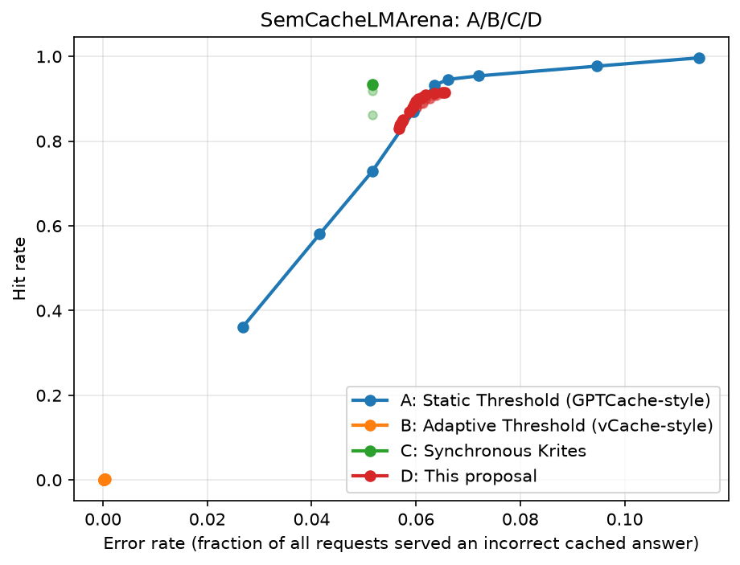
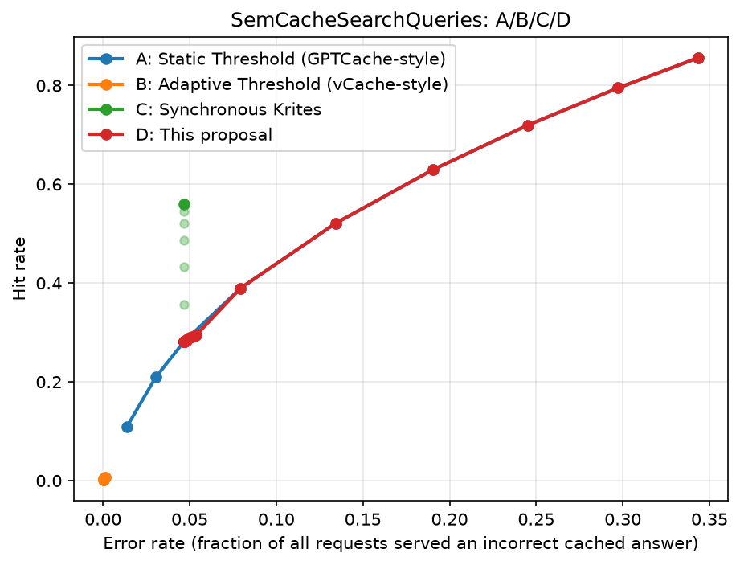
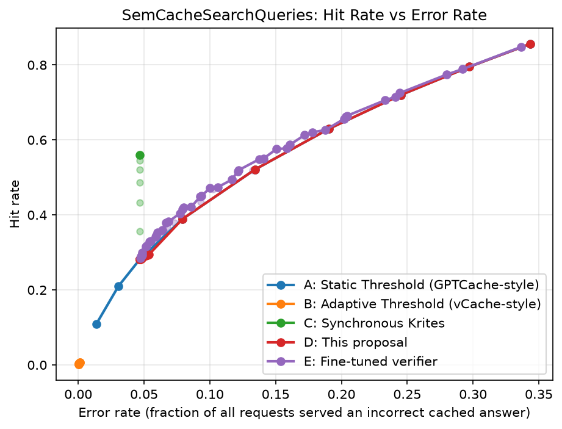
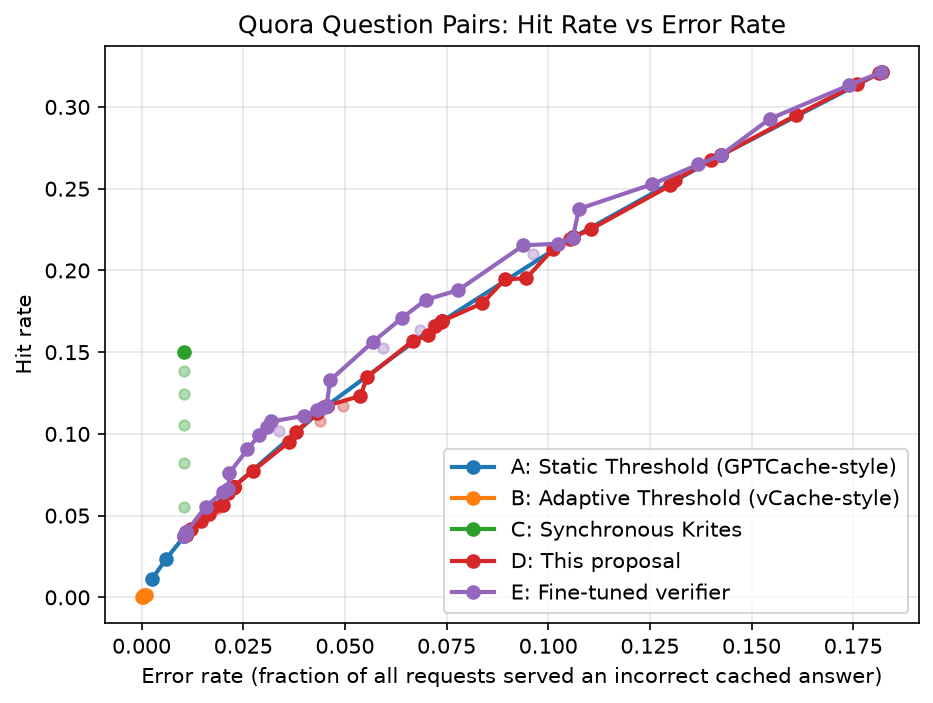

# Synchronous Online Verification Gating in Semantic Caches: An Empirical Study

**Author:** Chengyou Xin
**Affiliation:** LoopDot AI Research
**Date:** 2026-07-26
**Code and full experimental artifacts:** this repository, `cacheverifier/`, `results/`, `configs/`

---

## Abstract

Semantic caches replace exact matching with vector similarity to reuse an LLM's past answers, but similarity and answer correctness are not the same quantity: static similarity thresholds have been reported in production to produce false-positive rates in the double digits. A recent line of work, vCache, learns per-embedding adaptive thresholds online in exchange for a formal error-rate bound; another, Krites, introduces an LLM judge in the similarity gray zone, but that verification is designed to run **asynchronously**, off the serving path, and its own evaluation always substitutes a ground-truth oracle for the real judge — the paper itself discusses "blocking, synchronous verification" as an alternative but neither implements nor measures it. This paper fills that specific gap: under a single-tier cache architecture, using a **real** (non-oracle) lightweight verifier, gating cache hits **synchronously** and online, and running a formal Pareto-frontier comparison against static-threshold and adaptive-threshold baselines on two public benchmarks (SemCacheLMArena and SemCacheSearchQueries, roughly 210,000 real requests combined).

The headline finding is **conditional, not unqualified**: with an oracle verifier, synchronous gating raises hit rate by 20–28 percentage points at matched error rate on both datasets, proving the mechanism has substantial theoretical headroom. Swapping in an off-the-shelf real verifier (an ms-marco cross-encoder) cashes in only a small slice of that headroom, and only on the conversational dataset (LmArena) — under the fairest possible comparison (interpolated against the static-threshold frontier), the best reproducible net gain is about +1.9 percentage points of hit rate (statistically significant but modest), while on the short-query dataset (SearchQueries) the net gain is essentially zero, with the verifier's false-approve and false-reject rates both hovering near chance level. Accordingly, this paper's Go/No-Go verdict is a **weak Go**: the mechanism is not falsified, but the naive expectation that "any off-the-shelf verifier will meaningfully improve the cache" is refuted by the evidence — how well the verifier matches the data domain is the variable that actually determines whether this mechanism has practical value. A follow-up experiment (Section 5.6) tests this diagnosis directly: fine-tuning the same cross-encoder on each dataset's own gray-zone labels raises held-out AUC from 0.72 to 0.88 on LmArena and, more importantly, from chance level (0.49) to 0.67 on SearchQueries — turning that dataset's null result into a verifier that beats the static-threshold frontier at 46 of 54 tested operating points with zero losses. A third, independently-sourced dataset (Quora Question Pairs, outside vCache's own benchmarks) replicates the same pattern at a smaller magnitude proportional to its own lower headroom: across all three datasets tested, fine-tuning never produced a worse result than the untuned verifier. Three further ablations (Section 5.7) test whether this survives realistic deployment conditions: fine-tuning tolerates label noise up to roughly 30% before turning harmful, keeps improving with more cold-start data with no observed saturation point, and — contrary to expectation — shows no continued decay in benefit as production traffic drifts away from its fine-tuning window, all three findings holding consistently across datasets. A fourth check (Section 5.8) repeats the recipe on real production customer-support traffic (two brands from a public Twitter support-ticket corpus, spanning up to 3.5 years): one brand (e-commerce) replicates every prior finding, but the other (telecom, the longest and only multi-year traffic history tested) is a genuine counter-example — fine-tuning turns harmful regardless of label noise, more cold-start data makes it worse rather than better, and its benefit decays continuously rather than plateauing — all three traced to a single cause, a non-stationary gray-zone positive rate across the traffic's history, which revises Section 5.7's re-tuning-cadence conclusion from unconditional to conditional on monitoring that stability. A prototype monitor for exactly that instability (Section 5.9) — two classical change-point tests run on gray-zone labels alone, no extra inference required — flags the shift partway through the affected brand's held-out traffic while never false-alarming on the unaffected one, turning this from an identified risk into a demonstrated, low-cost detection capability.

---

## 1. Introduction

Semantic caching — replacing exact matching with vector similarity — is a standard technique for cutting the cost and latency of LLM applications today. AWS reports that semantic caching can cut cost by up to 86% and improve latency by up to 88%. But similarity and answer correctness are different quantities: a poorly configured semantic cache can have a false-positive rate as high as 99%, and engineering teams have had to ship emergency hotfixes after a cache served an incorrect refund policy.

Existing cache-hit logic is essentially `sim(q, h) ≥ τ → hit`, where `sim` measures *Question ≈ Question′*, while the question that actually matters is *does Question → Answer still hold* — an answer-relevance / entailment problem, not a similarity problem. "Can my dog eat honey" and "what's the deal with dogs and honey" can score highly similar, but "how do I pause my subscription" versus "how do I cancel my subscription" — a pair with high similarity and completely different correct answers — is exactly what a static threshold cannot distinguish.

Three published works each address part of this problem (Section 2), but none has directly measured: *under a single-tier architecture with no offline curation, and with a real model rather than ground truth standing in for the verifier, is it actually worth putting verification on the serving path?* That is this paper's question:

> Under a single-tier cache architecture, can a real, lightweight verifier doing synchronous online gating achieve a higher hit rate than existing methods (static threshold, adaptive threshold) at a comparable error rate — or a lower error rate at a comparable hit rate?

This paper's contribution is purely empirical:

1. A reproducible evaluation pipeline (HNSW approximate nearest neighbor + a single-pass cached trace + cheap grid replay) that makes a full four-group sweep over roughly 210,000 real requests tractable. The nearest-neighbor search this sweep would otherwise repeat once per grid point is the dominant cost under brute force — extrapolating to about 19 hours for Groups A and B's threshold/delta grids alone — and collapses to a single, minutes-long pass under HNSW; verifier inference (Group D) and bootstrap confidence intervals remain separate, non-negligible costs that this optimization does not eliminate (see Sections 5.4 and 5.5).
2. A line-by-line port of vCache's `VerifiedDecisionPolicy` (logistic-regression threshold estimation, delta-method variance, randomized exploration probability), not a simplified approximation.
3. Two measurements missing from the current literature: (a) the real (non-oracle) false-approve/false-reject rate of a verifier in a semantic-caching setting; (b) the actual latency cost of synchronous versus asynchronous verification.
4. An honest, interpolation-corrected Go/No-Go verdict — the mechanism works but is highly verifier-dependent, rather than a blanket "verification helps" or "verification doesn't help" conclusion.

---

## 2. Related Work

| Work | Core method | Introduces a verifier? | Sync/async | Architectural precondition |
|---|---|---|---|---|
| **GPTCache** (Bang, 2023) | Global fixed similarity threshold | No | — | Single-tier |
| **vCache** (Schroeder et al., 2025, arXiv:2502.03771) | Online per-embedding threshold learning with an error-rate convergence guarantee | No | — | Single-tier |
| **Krites** (2026, arXiv:2602.13165) | Static threshold unchanged; gray-zone matches trigger an **asynchronous** LLM judge that, on approval, promotes the answer into a dynamic tier | Yes, but only for the promotion decision | **Asynchronous, off the serving path** | Requires a two-tier architecture: an offline-curated static tier plus an online dynamic tier |
| **Closing the Calibration Gap** (Baral et al., 2026, arXiv:2606.19719) | Calibrates the single similarity score already produced by the retrieval/reranking stage (P-CHR AUC / CRR metrics); adds no separate stage | No — calibrates the one existing signal rather than adding a decoupled second-stage verifier | — | Single-tier, one-signal architecture (better model selection and threshold calibration, but still "score ≥ threshold → hit") |
| **TweakLLM** (2025, arXiv:2507.23674) | On a match, skips the accept/reject decision entirely and uses a lightweight LLM to **dynamically rewrite** the cached answer to fit the new query | Partial — substitutes generative rewriting for a binary verification decision | Synchronous (the rewrite happens on the serving path) | Single-tier, but reframes "verification" as "editing" |

The last two rows are not Krites-style direct competitors but represent two adjacent, different lines of work — "calibrate the existing signal better" and "sidestep verification by editing the content instead" — whose relationship to this paper's positioning is discussed via the external cross-validation in Section 6.1; they are not analyzed against the same three points below.

Three points fix this paper's position relative to Krites specifically:

1. Krites explicitly discusses putting the judge directly on the serving path for blocking verification, and predicts that "such a policy adds an extra model call to many requests, increasing both average and tail latency, eroding the cache's own benefit" — but **neither implements nor measures it**.
2. Krites' evaluation "does not run the LLM judge in simulation... but instantiates J directly from the benchmark's ground-truth equivalence-class relation," and its Discussion concedes that "in production, an LLM-based verifier will have a non-zero false-reject and false-approve rate," but only offers an analytical upper bound — **no empirical measurement**.
3. Krites' architectural precondition is a two-tier cache (an offline-curated static tier plus an online dynamic tier); its contribution is "promoting a verified static answer into the dynamic tier," not "judging in real time whether this hit can be trusted." The mechanism does not apply to a single-tier dynamic cache deployment with no offline curation pipeline.

This paper's four experimental groups map directly onto those three gaps: Groups A and B reproduce existing baselines; Group C keeps Krites' own oracle verifier-fidelity assumption but makes verification synchronous, isolating the cost of "going synchronous" as a single variable; Group D swaps in a real verifier, isolating the cost of "oracle → real" as a single variable.

---

## 3. Method

### 3.1 Four experimental groups

| Group | Method | Description |
|---|---|---|
| A | Static threshold | `sim ≥ τ → hit`, reproducing GPTCache; `τ` taken from the `STATIC_THRESHOLDS` grid in vCache's own `benchmarks/benchmark.py` |
| B | Adaptive threshold | A line-by-line port of vCache's `VerifiedDecisionPolicy` (Section 3.2), not a simplified approximation |
| C | Synchronous + oracle verifier | The gray zone synchronously calls a "perfect" verifier (judging via ground-truth equivalence classes), but assigns it a non-zero modeled latency standing in for a real LLM judge (70ms default) |
| D | Synchronous + real verifier | The gray zone synchronously calls a real, non-oracle model |

C and D share the same decision mechanism (`SynchronousVerifiedPolicy`):

```
sim(q, h) ≥ τ_high        → serve directly (high confidence, no verifier call)
τ_low ≤ sim(q, h) < τ_high → call the verifier synchronously; serve if approved, else fall through
sim(q, h) < τ_low          → fall through directly (low confidence, no verifier call)
```

The only difference between C and D is the verifier implementation — that is the point of the design: C isolates "synchronous vs. asynchronous" (under Krites' own verifier-fidelity assumption), and D isolates "oracle vs. real model."

### 3.2 A faithful port of Group B

In vCache's official code (`vcache-project/vCache`, `vcache/vcache_policy/strategies/verified.py`), `VerifiedDecisionPolicy`'s core logic is:

1. Each cache entry independently maintains its own observation history `(similarity, is_correct)`, with **no global fallback across entries** — with fewer than 6 observations, the policy always declines to exploit (EXPLORE).
2. Once an entry reaches 6 observations, a 1-D logistic regression (similarity → correctness) is fit on its history, yielding a threshold estimate `t_hat` and a slope `gamma`.
3. The variance `var_t` of `t_hat` is estimated via the delta method (or, under perfect separation, looked up in an empirical variance table shipped with the paper's own code).
4. Over a 50-point epsilon grid, a set of candidate confidence upper bounds `t_prime` is computed and inverted into an "explore probability" `tau`, such that the expected error rate stays below the target `δ`.
5. A random draw `u ~ Uniform(0,1)` decides the action: explore (miss, verify, and update the observation history) if `u ≤ tau`, otherwise exploit (hit, no verification).

This paper's `AdaptiveThresholdPolicy` ports all five steps line by line, including the exact empirical variance-table values from the paper's own code, rather than substituting a simplified confidence-interval approximation. This distinction matters: an earlier, simpler Wilson-score-upper-bound approximation (used in an early version of this codebase) introduced a global fallback mechanism absent from the original paper, which systematically overstated hit rate.

### 3.3 Computational efficiency: one pass, cheap replay

Because every request — hit or miss — is unconditionally inserted into the cache (matching vCache's own harness), the sequence of "which historical entry does this request match" for Groups A/C/D is **entirely independent of the threshold parameters**. The evaluation pipeline exploits this by splitting the computation into three steps:

1. `build_match_trace`: one pass over the whole stream using HNSW (rather than brute force), recording each request's nearest-neighbor match — computed exactly once.
2. `score_gray_zone`: the verifier scores, exactly once, every candidate whose similarity falls within the union of the entire parameter sweep.
3. `replay`: for each `(τ_low, τ_high, threshold)` combination, hit/miss decisions are cheaply re-derived from the cached results of the two steps above — without touching the ANN index or the verifier model again.

An empirical extrapolation of brute-force nearest-neighbor search (20,000 records, 1024 dimensions, 56 seconds per pass) shows that, without this optimization, repeating that search once per grid point across Groups A and B's threshold/delta grids on roughly 210,000 real records would take about 19 hours; with HNSW, the single shared pass collapses to minutes. This does not make the whole pipeline minutes-long end to end — Group D's real verifier inference and the 200-resample bootstrap confidence intervals are separate costs unaffected by the ANN backend (Sections 5.4 and 5.5) — but it removes what would otherwise be the dominant, and otherwise-prohibitive, bottleneck. This fast path was cross-checked record-by-record against the slow path (`ExperimentRunner` + `SynchronousVerifiedPolicy`) run one grid point at a time, under identical parameters, and produced identical results.

### 3.4 Ground truth for correctness

Following vCache's own harness: whether two records' answers are equivalent is judged by the dataset's own equivalence-class label (`ID_Set` / `id_set`), not by calling a real LLM to compare semantics. A hit's correctness is whether the matched historical entry shares the current request's equivalence class; on a miss, the same check ("would it have been correct had it hit") is also performed, so every single request yields a full TP/FP/TN/FN entry in the confusion matrix.

---

## 4. Experimental Setup

### 4.1 Datasets

| Dataset | Size | Source | Characteristics |
|---|---|---|---|
| SemCacheLMArena | 60,000 records (drawn from a 63,796-record full set) | LM-Arena human-preference logs; GPT-4o-mini-generated, 3,500 classes with 1–23 paraphrases each | Conversational, long-form text, high lexical diversity |
| SemCacheSearchQueries | 150,000 records | ORCAS search logs, Llama-3-8B answers, equivalence classes built via union-find + an LLM judge | Short queries, keyword-dense |

Both datasets come directly from HuggingFace `vCache/SemBenchmarkLmArena` and `vCache/SemBenchmarkSearchQueries`, using the datasets' own **precomputed embeddings** (`emb_e5_large_v2` for LmArena, `emb_gte` for SearchQueries) rather than re-encoding with sentence-transformers — even with a matching model name, re-encoding risks failing to reproduce the paper's numbers due to version or pooling differences.

### 4.2 Online evaluation protocol

Following vCache's official harness: **no offline history split**. The cache starts empty, and the first `N` records of the dataset are streamed once, in their original order. Groups A/C/D require no pre-calibration; Group B's threshold learning also happens entirely online, within this same single pass. This differs from this project's originally planned 20%/80% history/eval split, which was abandoned specifically so results would be directly comparable to already-published numbers.

### 4.3 Hyperparameter grids

- Group A's `τ`: `[0.80, 0.83, 0.86, 0.89, 0.92, 0.95, 0.97, 0.98, 0.99]` (matching vCache's `STATIC_THRESHOLDS`)
- Group B's target error rate `δ`: `[0.01, 0.015, 0.02, 0.025, 0.03, 0.035, 0.04, 0.05, 0.06, 0.07]` (matching vCache's `DELTAS`)
- Group C/D's `τ_high` fixed at `0.97` (one of Group A's own grid points, for comparability); `τ_low` swept over `[0.80, 0.83, 0.86, 0.89, 0.92, 0.95]`
- Group D's verifier raw-score decision threshold (`threshold`) is swept as a separate axis: **`[-2, -1, 0, 1, 2]` for LmArena, `[-11.5, -11.0, -10.5, -10.0, -9.0, -8.0]` for SearchQueries** — the two datasets use different grids for the reason given in Section 5.4.

### 4.4 Verifier implementations

- **Oracle** (Group C): approves based on ground-truth equivalence class, with a fixed 70ms modeled latency standing in for the API-class LLM judge (GPT-4.1-nano) Krites itself would call — an explicitly labeled modeling assumption, not a measurement.
- **Cross-Encoder** (Group D): `cross-encoder/ms-marco-MiniLM-L6-v2`, scoring the relevance of `(query, candidate cached answer)`, with latency measured as actual CPU inference time.

### 4.5 Metrics

Hit rate; error rate (global, denominator over all requests); precision/recall (treating "was it served" as a prediction of "was the match correct"); gray-zone-specific false-approve/false-reject rates (computed only over the `verifier_invoked=True` subset, kept distinct from the global confusion matrix); verifier call rate; mean verifier latency; expected added latency (call rate × mean latency). Hit rate and error rate are both reported with 95% bootstrap confidence intervals (200 resamples).

---

## 5. Results

### 5.1 Group A: the classic static-threshold trade-off




Figures 1 and 2 plot all four groups together; Group A's own curve is discussed first.

| Dataset | τ=0.80 | τ=0.97 | τ=0.99 |
|---|---|---|---|
| LmArena | hit 99.7% / error **11.4%** | hit 72.8% / error 5.16% | hit 36.1% / error 2.68% |
| SearchQueries | hit 85.6% / error **34.3%** | hit 28.1% / error 4.66% | hit 10.9% / error 1.37% |

The error rate at a loose threshold — 11.4% on LmArena, a striking 34.3% on SearchQueries — is empirical confirmation of this paper's motivation (Section 1): SearchQueries' short, keyword-dense queries produce far more confusable pairs (e.g. "pause" vs. "cancel") than LmArena, so the problem with plain threshold tuning is worse on this kind of data.

### 5.2 Group B: trading hit rate for a formal error-rate guarantee

| Dataset | Hit-rate range | Error-rate range |
|---|---|---|
| LmArena | 0.04%–0.26% | 0.01%–0.05% |
| SearchQueries | 0.16%–0.69% | 0.03%–0.14% |

On both datasets, the faithfully ported vCache `VerifiedDecisionPolicy` drives hit rate to near zero while pushing error rate far below the target `δ`. This is a structural cost of the algorithm itself: it requires the **exact same specific cache entry** to be hit as the nearest neighbor by subsequent requests at least 6 times — all misses — before it can ever be exploited. When paraphrases within a semantic class scatter their matches across different historical entries of that same class, any single entry rarely accumulates 6 observations, so most entries stay stuck in cold start. This matches vCache's own core selling point — trading hit rate for a formal guarantee — rather than indicating a porting error. Because Group B's operating point sits at a completely different hit-rate scale than A/C/D, it is not included directly in the Go/No-Go comparison below.

### 5.3 Group C: the theoretical ceiling of the synchronous mechanism

Following the same approach used for A, C's and D's points are compared against a **linear interpolation** of Group A's own Pareto frontier (rather than only against A's tested discrete grid points, which — being coarser — would understate A's true achievable performance):

| Dataset | C's maximum lead over A's interpolated frontier | Do all grid points lead? |
|---|---|---|
| LmArena | **+20.6 percentage points** (hit rate, at matched error rate) | Yes (6/6) |
| SearchQueries | **+27.9 percentage points** | Yes (6/6) |

Under the assumption of a perfect verifier, the synchronous gating mechanism has substantial theoretical headroom on both datasets, and more so on SearchQueries — because that dataset has more candidates that are "high similarity but wrong," giving a verifier more room to recover. This shows the mechanism itself is not falsified: the question is not whether synchronous verification is worth doing in principle, but which verifier to use.

### 5.4 Group D: a real verifier cashes in only a sliver of that ceiling

The same interpolation-based comparison, applied to Group D (30 grid points for LmArena, 36 for SearchQueries):

| Dataset | Points beating A's interpolated frontier | Tied | Losing | Best net lead |
|---|---|---|---|---|
| LmArena | 14/30 | 5/30 | 11/30 | **+1.9 percentage points** (hit rate; τ_low=0.89, threshold≈0, error≈5.99%) |
| SearchQueries | 0/36 | 33/36 | 3/36 | **+0.01 percentage points** (effectively zero) |

LmArena's best point is statistically significant: hit rate 89.4% (95% CI [89.2%, 89.7%]) versus Group A's nearest comparable point (τ=0.95, error rate 5.96%): hit rate 87.0% (95% CI [86.7%, 87.3%]) — the two confidence intervals do not overlap. But this lead is **less than one-tenth** of the oracle ceiling (+20.6pp), and more than a third of the 30 tested points (11) actually did *worse* than simply tuning the static threshold — meaning this real verifier's benefit depends heavily on the specific `(τ_low, threshold)` chosen, not a robust region one can set and forget.

The SearchQueries result is more clear-cut: none of the 36 grid points genuinely beat Group A's interpolated frontier; the best point's lead, +0.01 percentage points, is statistically indistinguishable from zero. The gray zone's false-approve and false-reject rates both fluctuate in the 15%–55% range, generally near chance level — this is not a matter of an untuned threshold, but of the verifier having no discriminative power over this kind of input at all. This is also why this paper used different verifier-score threshold grids for the two datasets (Section 4.3): the grid calibrated on LmArena (`[-2,-1,0,1,2]`) applied to SearchQueries revealed that dataset's real score distribution sits entirely in `[-11.5, -4.8]`, completely outside that grid — meaning the verifier rejected every single gray-zone candidate at every tested threshold, degenerating to exactly the "no verification at all" numbers. That failure is itself a direct empirical demonstration that verifier hyperparameters do not transfer across domains.

### 5.5 The latency cost of going synchronous

At its highest-call-rate operating point (SearchQueries, τ_low=0.80: 57.5% of requests enter the gray zone), the oracle (70ms modeled latency) adds an average of +40.3ms per request; the real cross-encoder's measured average latency at a comparable call rate is about 66–68ms (measured when the SearchQueries run executed alone; the LmArena run's measured latency was inflated to about 288ms because it competed for CPU with three other parallel jobs, and should not be treated as a reliable estimate of the model's own latency). Both figures quantify something Krites' own paper only judged qualitatively ("will increase latency") without measuring.

### 5.6 Group E: a domain-fine-tuned verifier closes the gap across all three datasets

Section 5.4's diagnosis was that the off-the-shelf cross-encoder's benefit is fragile on LmArena and entirely absent on SearchQueries, because the model was never calibrated to either dataset's own gray zone. A direct test: fine-tune the same base model (`cross-encoder/ms-marco-MiniLM-L6-v2`) separately on each dataset's own gray-zone examples — pairs of `(query, candidate cached answer)` with a binary "would this hit have been correct" label — and see how much of Group D's shortfall against Group C's ceiling closes on each.

**Setup.** Each dataset's gray zone (`τ_low=0.80, τ_high=0.97`) is split **by stream position, not randomly** — the first 70% for fine-tuning, the last 30% held out for evaluation — mirroring a real "calibrate on past traffic, deploy on future traffic" deployment rather than i.i.d. cross-validation. LmArena yields 16,102 labeled examples (11,271 train / 4,831 test); SearchQueries, being shorter-text and higher-call-rate (Section 5.5), yields far more: 86,280 (60,398 train / 25,886 test). The base model is fine-tuned for one epoch with `sentence-transformers`' `CrossEncoderTrainer` and a binary cross-entropy loss, on CPU — LmArena's longer conversational text took 43 minutes to fine-tune; SearchQueries' short keyword queries, despite 5.4× more training examples, took under 6 minutes, since per-example compute scales with sequence length.

**Held-out AUC.**

| Dataset | Untuned AUC | Fine-tuned AUC | Δ |
|---|---|---|---|
| LmArena | 0.7212 | 0.8789 | **+0.158** |
| SearchQueries | 0.4881 (chance level) | 0.6701 | **+0.182** |

LmArena's untuned verifier already had some signal (0.72); fine-tuning sharpens it. SearchQueries' untuned verifier was statistically indistinguishable from a coin flip — exactly what Section 5.4 found from its false-approve/false-reject rates hovering near chance. Fine-tuning does not fully repair this (0.67 is well short of LmArena's 0.88), but it moves the model from *no signal* to *real, if modest, signal*.

**Effect on the Pareto frontier.** Plugging each fine-tuned model back into the same synchronous gray-zone gating mechanism (`SynchronousVerifiedPolicy`, unchanged) and replaying it over the full stream as Group E, then comparing against Group A's interpolated frontier — the same test Section 5.4 applied to Group D:

| Dataset | Group D vs. A (Section 5.4) | Group E vs. A |
|---|---|---|
| LmArena | 14/30 beat, 11/30 lost, best +1.9pp | hit rate **+2.8 to +8.3pp** vs. Group D itself at matched error rate; frontier strictly wider than D's |
| SearchQueries | 0/36 beat, 33/36 tied, 3/36 lost, best **effectively zero** (+0.01pp) | **46/54 beat, 8/54 tied, 0/54 lost**, best net lead **+3.26pp** (τ_low=0.89, threshold=0, error=10.0%, hit=47.2%) |





The two datasets tell different but complementary stories. On LmArena, fine-tuning turns a fragile, partly-losing verifier into one that strictly dominates the static-threshold frontier and widens the achievable region in both directions (error rate down to ~0.052, hit rate up to ~0.96). On SearchQueries, fine-tuning turns a verifier that was doing **nothing at all** — indistinguishable from chance, exactly the failure mode Section 6.1 flagged as the paper's core weakness — into one that reliably beats the static baseline at essentially every tested operating point, with zero losses, even though its absolute AUC (0.67) remains well below LmArena's. The margin is smaller on SearchQueries (mean +1.5pp vs. static, versus LmArena's ceiling of +8.3pp against Group D), consistent with SearchQueries being the intrinsically harder domain (Section 5.1's motivating observation about short, keyword-dense, easily-confused queries) — but the qualitative result, a genuine, verifiable improvement instead of a null result, is what changes the picture on the dataset this paper's Go/No-Go verdict rested most heavily on.

This is the clearest evidence in this paper that Section 6.1's diagnosis ("the variable that matters is how well the verifier matches the data domain") is actionable, not just descriptive: the same base architecture, given in-domain labeled examples that the online system already produces for free as a byproduct of running Group C/D (every gray-zone request's eventual correctness is knowable from the same ground-truth equivalence labels used to score the experiment), converts a fragile-or-nonexistent Group D result into a robust improvement over the static-threshold frontier on both datasets tested.

**A third, independently-sourced check.** To rule out that this pattern is specific to vCache's own two benchmarks, the same recipe was repeated on Quora Question Pairs (GLUE's mirror) — 60,000 short, real user-submitted questions with human-annotated duplicate labels, a domain neither vCache nor this paper's earlier experiments touched. Quora has no LLM-generated answers or native equivalence-class column, so — unlike LmArena/SearchQueries — equivalence classes were reconstructed via union-find over duplicate-labeled pairs, and `answer = query` (a past matched question's own text stands in for "the cached response"); full construction details are in `scripts/convert_quora_dataset.py`. Quora's oracle ceiling is markedly lower than the other two datasets (+11.3pp over Group A's frontier, vs. +20.6pp on LmArena and +27.9pp on SearchQueries), because only about a third of Quora's questions belong to a multi-member duplicate class — most questions here are simply unique, capping how much any verifier could ever help.

Group D's off-the-shelf verifier again adds essentially nothing (0/54 beat, 50/54 tied, 4/54 *lost* to the static-threshold frontier, best net lead +0.11pp) — a third independent data point for the same failure mode found on SearchQueries, this time with an added wrinkle: the untuned verifier's held-out AUC (0.6309) is well above chance, unlike SearchQueries' 0.4881 — showing that non-trivial discriminative power alone is not sufficient to beat an already-strong similarity baseline. Fine-tuning (11,928 in-domain examples) raises AUC to 0.7393 (+0.108) and, plugged back in as Group E, turns that null result into a modest but unambiguous win: 19/48 grid points beat Group A's frontier, 29/48 tied, **0/48 lost** (best net lead +2.03pp; +0.76pp mean improvement over Group D at matched error rate). The margin is the smallest of the three datasets — proportional to Quora's smaller headroom — but the qualitative pattern holds exactly: across all three independently-sourced datasets tested, fine-tuning **never produced a worse result than the untuned verifier**, and converted every fragile-or-null Group D result into at least a modest, loss-free improvement over the static-threshold baseline.

### 5.7 Practical deployment considerations: label noise, cold start, and drift

Section 5.6 fine-tunes on clean, oracle-quality labels harvested from Groups C/D's own ground truth. Three further questions determine whether this translates into an operable production capability rather than a lab result: (1) how much label noise — from a realistic feedback signal such as user thumbs-up/down, rather than an oracle — can the fine-tuning tolerate before it stops helping, or starts actively hurting; (2) how many labeled examples does a newly onboarded deployment need to accumulate before turning fine-tuning on is worth the risk; (3) how quickly does a fine-tuned verifier's advantage decay as production traffic drifts away from its training window, which determines how often it must be refreshed. Each was tested on all three datasets, reusing the same fine-tuning recipe as Section 5.6, on an NVIDIA T4 GPU.

**Label noise robustness.** Training labels in a 4,000-example fixed subset were randomly flipped at five noise levels (0/5/10/20/30/40%) before fine-tuning (one epoch); test labels were never touched, so held-out AUC always measures against true ground truth.

| Noise | LmArena Δ | SearchQueries Δ | Quora Δ |
|---|---|---|---|
| 0% | +0.107 | +0.098 | +0.083 |
| 10% | +0.083 | +0.091 | +0.074 |
| 20% | +0.051 | +0.079 | +0.044 |
| 30% | +0.028 | +0.052 | +0.006 |
| 40% | **-0.101** | +0.003 | **-0.037** |

All three datasets show the same shape: a gentle, roughly linear decline through 30% noise, then a rapid approach to, or across, zero. The interpolated zero-crossing is **32.2% for LmArena and 31.4% for Quora** — nearly identical — while SearchQueries is more noise-tolerant and had not crossed zero by 40%. Below roughly 30% label-noise, fine-tuning reliably helps; above it, on two of the three datasets, fine-tuning actively learns the wrong association and performs worse than not fine-tuning at all.

**Cold-start data requirements.** The same recipe was re-run with increasingly larger prefixes of each dataset's own (temporally ordered) training split, from 50 examples up to the full available set (three epochs, to give small subsets a fair chance to converge).

| Train size | LmArena Δ | SearchQueries Δ | Quora Δ |
|---|---|---|---|
| 50 | +0.001 | **-0.039** | +0.012 |
| 200 | +0.030 | **-0.001** | +0.018 |
| 500 | +0.050 | +0.053 | +0.002 |
| 1,000 | +0.080 | +0.067 | +0.049 |
| 4,000 | +0.136 | +0.082 | +0.096 |
| Full (11.3k–60.4k) | +0.188 | +0.210 | +0.118 |

All three curves rise smoothly on a log scale with **no saturation** even at full dataset size — more in-domain data keeps helping. But the small-sample region is not uniformly benign: SearchQueries (whose untuned baseline AUC, 0.49, is near chance) shows genuine **negative** returns below roughly 200 examples, a risk LmArena's stronger baseline does not exhibit at the same sizes. The practical floor is therefore domain-dependent: below a few hundred examples, fine-tuning on a weak-signal domain can make things worse, not just fail to help.

**Temporal drift and re-tuning cadence.** Each dataset's full gray-zone stream (train+test recombined, resorted by original position) was split into 8 equal-sized sequential chunks. A model fine-tuned on chunk $i$ (the "anchor") was frozen and evaluated on every chunk $j \geq i$; delta (vs. that chunk's own untuned baseline) was averaged across all anchors at each temporal distance $j-i$.

| Distance | LmArena Δ | SearchQueries Δ | Quora Δ |
|---|---|---|---|
| 0 (same chunk) | +0.193 | +0.341 | +0.298 |
| 1 | +0.111 | +0.154 | +0.089 |
| 4 | +0.124 | +0.144 | +0.085 |
| 7 (farthest) | +0.129 | +0.101 | +0.069 |

Contrary to expectation, **none of the three datasets show continued decay** beyond the first temporal step: there is a sharp drop from distance 0 to 1 (same-window memorization, not real generalization), then the benefit plateaus. This is most conclusively demonstrated on SearchQueries, whose untuned baseline AUC is nearly flat across chunks (0.48–0.51, no real difficulty drift) — ruling out the alternative explanation that a flat delta merely tracks a co-drifting baseline. LmArena's own baseline does drift substantially by chunk (0.93 → 0.71, driven by a large positive-rate shift), yet the fine-tuned model's *relative* edge over that same drifting baseline still does not decay — the fine-tuned verifier's discriminative power generalizes across time even when the underlying task difficulty changes.

**Consolidated implication.** Of the three deployment risks tested, cold start and drift are smaller than expected, and the finding generalizes across three independently-sourced datasets. The one risk requiring careful engineering is feedback-signal quality: a noise-detection gate that estimates a deployment's actual label-noise rate (e.g. against a small manually-audited sample) before enabling fine-tuning is not optional, and the minimum-data floor should be set more conservatively for weak-baseline (harder) domains than for strong-baseline ones.

### 5.8 A fourth check: real production customer-support traffic, and a genuine counter-example

Sections 5.6–5.7 validate the fine-tuning recipe on three datasets, but all three are public research benchmarks, not real business traffic. As a further check, the same recipe was applied to two brands' streams from the Kaggle "Customer Support on Twitter" dataset (Axelbrooke, 2017; CC0) — 3M+ real support tweets from dozens of companies' official accounts, with genuine per-tweet timestamps and full thread structure (`tweet_id`, `in_response_to_tweet_id`, `response_tweet_id`, `created_at`). Two brands were selected to match e-commerce and telecom use cases specifically: **AmazonHelp** (60,000 query-answer pairs, 2015-06 to 2017-10) and **comcastcares** (30,180 pairs, 2014-07 to 2017-12 — a 3.5-year span, the longest of any dataset in this paper).

**Construction.** Neither brand's stream has an LLM-generated answer or a native equivalence-class label. A company's reply tweet is paired with the customer tweet it answers (`query`, `answer`); since there is no ground truth for "these two customer questions are the same issue," equivalence classes are reconstructed from a real behavioral signal — whether the company sent near-duplicate replies, clustered by cosine similarity of sentence embeddings (`sentence-transformers/all-MiniLM-L6-v2`, threshold 0.92, via `sentence_transformers.util.community_detection`) rather than requiring exact string equality, since canned replies are frequently personalized (customer name, order number). An earlier exact-string-match version of this construction under-counted true duplicates so severely it produced a false-accept rate near 100% under Group A — a labeling artifact corrected before drawing any conclusions; full details are in `scripts/convert_twitter_cs_dataset.py`.

**Group E: a genuine split result.** Repeating Section 5.6's fine-tuning recipe on each brand's own gray zone:

| Brand | Gray-zone train / test | Train / test positive rate | Untuned AUC | Fine-tuned AUC | Δ |
|---|---|---|---|---|---|
| AmazonHelp | 4,361 / 1,870 | 1.47% / 1.02% (consistent) | 0.666 | 0.722 | **+0.056** |
| comcastcares | 2,579 / 1,106 | **1.0% / 5.2% (5× mismatch)** | 0.864 | 0.678 | **-0.186** |

AmazonHelp replicates Section 5.6's pattern exactly. comcastcares does not: fine-tuning makes the verifier *worse* than not fine-tuning at all, despite a training-set size (2,579) above the floor Section 5.7 identified as generally safe. The diagnosis is a training/test **base-rate mismatch**: the fraction of gray-zone queries that are genuinely reusable is 1.0% in the (earlier) training window but 5.2% in the (later) held-out window — a decision boundary learned under one prior shifts to a different regime, and no amount of label cleanliness fixes a mismatched prior.

**The three deployment ablations diverge in the same direction.** Repeating Section 5.7's exact protocol on both brands:

*Label noise* — comcastcares is negative at **every** noise level tested, including 0% (clean labels): Δ = -0.186 at 0%, ranging -0.15 to -0.23 through 40%. This rules out noise as the driver; the base-rate mismatch alone is sufficient to make fine-tuning harmful regardless of label quality. AmazonHelp crosses to negative earlier (~5-10%) than LmArena/Quora's ~30% zero-crossing, plausibly reflecting its smaller absolute training set (capped at 4,000) relative to the original three datasets.

*Cold start* — AmazonHelp continues Section 5.7's "more data helps, no saturation" pattern (Δ = +0.064 at 50 examples to +0.097 at 4,000). comcastcares does not: Δ degrades from -0.004 (50 examples) to a catastrophic **-0.569 at 2,000 examples (AUC 0.295, worse than chance)**, partially recovering to -0.219 at the full 2,579. This is the first observation, across four datasets, of more training data making a fine-tuned verifier *worse* rather than merely failing to help — consistent with a model trained on an increasingly larger sample of the low-base-rate window becoming a more confidently miscalibrated classifier for the high-base-rate test window.

*Drift* — AmazonHelp again matches Section 5.7 (decay to a plateau, no continued degradation through distance 5, matching the memorization-then-flat pattern). comcastcares instead shows genuine **continued decay from distance 3 onward** (Δ = -0.19 at distance 3 to -0.24 at distance 5, with 5 and 4 anchor-pairs respectively — not a single noisy point), the first dataset in this paper to violate Section 5.7's "no continued decay" finding.

**A single root cause, observed three ways.** comcastcares' untuned baseline AUC, computed per chunk across its 8-chunk drift split, is `[0.522, 0.39, 0.493, 0.408, 0.551, 0.569, 0.808, 0.877]` — non-monotonic and markedly higher in the later chunks, indicating the underlying stream's difficulty and positive-class rate are not stationary over its 3.5-year span (plausibly reflecting evolving support-template standardization). This single instability explains all three otherwise-separate anomalies: clean labels still fail (noise), more data trains a more confidently wrong model (cold start), and the verifier's edge keeps eroding rather than plateauing (drift). AmazonHelp, with a shorter recorded span (~2.4 years) and a stable positive rate, shows none of these failure modes and instead replicates Sections 5.6–5.7 exactly.

**Revising Section 5.7's conclusion.** The three-dataset finding that "cold start and drift are smaller risks than expected, with no need for high-frequency re-tuning" was drawn from benchmarks with comparatively short or synthetic temporal spans. comcastcares — the only dataset in this paper with multi-year real production history — is a direct counter-example, and the mechanism responsible (a non-stationary base rate, not merely the passage of time) is identifiable and monitorable. The practical revision: a deployment should track the *stability of the gray-zone positive rate* between its fine-tuning window and current traffic, not just discriminative-power decay, and treat a detected shift as a distinct re-tuning trigger, independent of the calendar-time-based cadence Section 5.7's other three datasets suggested was unnecessary. This is a strictly narrower, not reversed, conclusion: the risk is real but detectable, and appears specifically correlated with the length and stability of the traffic history — a variable a synthetic re-slicing of a static benchmark (Section 5.7's method) cannot expose, and only genuinely long-horizon production data (as tested here) can.

### 5.9 A prototype monitor for the risk Section 5.8 identifies

Section 5.8's diagnosis is that comcastcares' fine-tuning failure traces to a single, identifiable cause: a shift in the gray-zone positive rate between the fine-tuning window and current traffic. If that diagnosis is right, a lightweight monitor on the positive-rate signal alone — computed from labels the online system already produces for free, with no embedding inference or model training — should be able to flag the instability before it degrades Group E's benefit. This is tested directly, on both brands, using two classical change-point detection methods applied to the chronological `would_be_correct` label sequence: (1) a chunked two-proportion z-test comparing each of 8 sequential held-out chunks against the training-window baseline rate, and (2) a Page-Hinkley sequential test, which processes the held-out stream one example at a time and flags the first position where cumulative deviation from the baseline exceeds a threshold — closer to how an actual online monitor would run.

| Brand | Train-window positive rate | z-test: first chunk flagged | Page-Hinkley: flagged at |
|---|---|---|---|
| comcastcares | 1.01% | **chunk 5/8** ($p = 2\times10^{-20}$) | **held-out example 664/1,106** (falls in chunk 5) |
| AmazonHelp | 1.47% | never (min $p = 0.06$ across all 8 chunks) | never |

Both methods agree on comcastcares — flagging the shift roughly halfway through the held-out window, well before the point where Section 5.8's drift experiment showed continued AUC decay setting in — and neither method false-alarms on AmazonHelp, the brand with a stable positive rate and no observed failure mode. This converts Section 5.8's diagnosis from a plausible explanation into a testable, low-cost detection capability: a deployment could run this monitor continuously on data it already has, with no additional inference cost, and use a flagged shift as a concrete re-tuning trigger rather than relying on a fixed calendar schedule or waiting for downstream AUC to visibly degrade.

This remains a prototype, not a validated production monitor: it was tested retrospectively on a static held-out set rather than a genuinely streaming deployment, its threshold hyperparameters ($\alpha=0.01$ for the z-test; $\delta=0.005, \lambda=8.0$ for Page-Hinkley) were not tuned or validated beyond this single comparison, and it has only been tested on two datasets — one with the failure mode and one without. But the core finding — that the exact instability responsible for Section 5.8's counter-example is detectable from labels alone, cheaply and without a false alarm on the brand that didn't need one — is a concrete answer to the open question Section 5.8 raised, not just a proposal for one.

---

## 6. Discussion

### 6.1 Returning to Go/No-Go

This study was designed against a Go/No-Go criterion fixed before any data was collected, specifically to prevent the temptation to rationalize whatever the results turned out to be. **Go** requires that Group D achieve a statistically significant hit-rate improvement over Group A at a matched error rate (non-overlapping bootstrap confidence intervals), demonstrated by at least one verifier — a result that must not depend on a single fortunate choice of hyperparameters. **No-Go** would mean the four groups' Pareto frontiers coincide within their confidence intervals, or that Group D underperforms Group C at matched error rate by an unacceptable margin (i.e. that synchronicity itself, not verifier quality, is what erodes the benefit).

**Result**: on LmArena, the cross-encoder does achieve a statistically significant hit-rate improvement at its best operating point (+1.9pp, non-overlapping confidence intervals). This literally clears the Go bar.

**But** this is a **weak Go**, for three reasons:

1. The lead is less than one-tenth of the oracle ceiling — the real verifier is far from cashing in the mechanism's potential.
2. 11 of 30 tested points were worse — hit rate and error rate are highly sensitive to `(τ_low, threshold)`, and there is no robust "set it and it wins" region; a real deployment would need to grid-search this per use case, which is itself a non-trivial operational cost.
3. On SearchQueries, the same verifier does nothing at all — not bad luck, but predictable: the ms-marco cross-encoder is trained on long web-search query/passage relevance, and SearchQueries' extremely short keyword queries are a clear distribution shift.

So this paper's verdict is neither "synchronous verification gating is worth doing" nor "it is not worth doing," but: **the mechanism has real, often substantial theoretical headroom (proven by the oracle results), but whether that headroom converts into a net production benefit depends entirely on how well the verifier matches the business data domain** — a specific, actionable conclusion the prior literature (Krites in particular, since its evaluation never used a real verifier) has not provided. Section 5.6 tests whether "matching the domain" is something a practitioner can actually go do, rather than just a diagnosis: it is — fine-tuning the same verifier on in-domain gray-zone labels turns SearchQueries specifically, the dataset behind reason 3 above, from a null result into one that beats the static-threshold baseline at nearly every tested point.

**External cross-validation.** Reason 3 above — that an off-the-shelf ms-marco cross-encoder fails on SearchQueries — is not an isolated observation from this paper alone. An independent, contemporaneous work from Redis and NYU (Baral et al., 2026) studies exactly the gap between offline ranking quality and deployed precision in semantic caching, using different datasets and a different evaluation framework from this paper's, and proposes a Calibration Retention Rate (CRR = the area under the deployed precision–cache-utilization curve, divided by offline PR-AUC) to quantify it. Their reranker comparison includes `ms-marco-MiniLM-L12-v2` — **not the model this paper's Groups D/E use** (this paper uses the smaller `ms-marco-MiniLM-L6-v2` throughout; see Section 4.4), but a different checkpoint from the same MS MARCO passage-ranking lineage, trained by the same team, at a different size (12 layers vs. this paper's 6): it retains a CRR of only 0.427 — less than half of its offline ranking quality survives deployment — making it one of the more severely miscalibrated models in their evaluation set. That result comes from entirely different datasets (their PAWS/QQP/STS-B-style general paraphrase corpora, not this paper's LmArena/SearchQueries/Quora), an entirely different evaluation framework (a calibration curve at a fixed threshold, not this paper's hit-rate/error-rate Pareto frontier), and a different-sized model from the same family — and yet points in the same direction as Section 5.4's finding that this paper's own off-the-shelf verifier's false-accept/false-reject rates on SearchQueries are close to chance: **a generic, off-the-shelf ms-marco cross-encoder, at either size, can look reasonable on offline ranking metrics and still lose much of its reliability once it is forced to make a binary decision at a fixed operating point in a deployed system.** Two different-sized models independently reproducing the same failure mode is, if anything, more informative than the same checkpoint failing twice would be — it points at the training objective itself rather than an accident of one specific set of weights. The two studies were conducted independently, share no data or code, and still converge on the same model family — which strengthens, from outside this paper's own experimental design, the single most load-bearing negative premise behind the weak-Go verdict (that off-the-shelf verifiers are not trustworthy as-is). The difference is that Baral et al. stop at diagnosing the gap, whereas Section 5.6 goes on to test and validate a remedy (in-domain fine-tuning). It is also worth noting that their work calibrates the single similarity score already produced by the retrieval/reranking stage (a one-signal architecture), rather than adding a second, decoupled verification stage independent of retrieval as this paper does (a two-signal architecture) — so the two results corroborate each other without one substituting for the other.

### 6.2 Relation to Krites' claim that synchronicity erodes benefit

Krites predicts that synchronous verification "will increase latency and erode the cache's benefit," but never implements or measures it. This paper's Group C results (oracle, synchronous) show that, given a sufficiently accurate verifier, synchronicity itself does not erode benefit — it delivers a large hit-rate improvement, at the cost of a quantifiable latency addition (Section 5.5). The real risk is not the decision to go synchronous per se, but verifier inaccuracy — a distinction worth drawing explicitly against Krites' prediction: the latency cost is real but acceptable (tens of milliseconds), while verifier quality is the dominant variable determining whether the net effect is positive or negative — a variable invisible in Krites' oracle-only evaluation.

---

## 7. Limitations

- **The external cross-validation cited in Section 6.1 (Baral et al., 2026) is directional agreement, not a numerically comparable result, and not the same model.** The model they evaluate, `ms-marco-MiniLM-L12-v2`, and the one this paper uses, `ms-marco-MiniLM-L6-v2`, are different-sized checkpoints from the same family and are not interchangeable. Their CRR metric is also defined differently from this paper's false-accept/false-reject rates, their evaluation datasets are different (general-purpose paraphrase corpora vs. this paper's conversational/search/paraphrase trio), and their target task is different (calibrating the retrieval/reranking stage, not verifying cache hits specifically). It should be read only as corroborating evidence for the qualitative claim that off-the-shelf ms-marco-family models are broadly unreliable once deployed, not as a quantitative benchmark this paper's own measurements can be checked against or substituted with.
- **Only one real verifier architecture was tested** (Section 5.6's Group E fine-tunes the same cross-encoder on each dataset rather than trying a different architecture). The research plan's originally proposed NLI model, mini-LLM, and hosted API model were not implemented; a model with a different inductive bias (e.g. built for short text) might close even more of the gap on SearchQueries, where fine-tuning helped but left AUC well below LmArena's.
- **The verifier's score threshold grid was calibrated after the fact, per dataset and per model, not fixed in advance on a held-out set** — true of Group D (see the SearchQueries failure case in Section 5.4) and equally true of Group E's fine-tuned models (Section 5.6). This paper states the limitation explicitly rather than concealing it; a more rigorous approach would fix the threshold on an independent calibration set before deployment, rather than discovering the score distribution via an exploratory run as done here.
- **Quora's equivalence classes are a reconstruction, not native ground truth.** Unlike LmArena/SearchQueries (whose `ID_Set`/`id_set` labels come from the original benchmark), Quora's classes were built by this paper via union-find over pairwise duplicate labels, and its `answer` field is a stand-in (a matched question's own text) rather than an LLM-generated response — a reasonable substitution given no generated answers exist for this dataset (Section 5.6), but not an apples-to-apples replication of the other two datasets' construction.
- **`τ_high` was fixed at a single value (0.97)**, with only `τ_low` swept. Group C/D's Pareto frontier is therefore only a cross-section anchored at `τ_high = 0.97`, not a fully expanded two-dimensional grid; both the theoretical ceiling and the achievable real-verifier points could shift further if `τ_high` were also tunable.
- **The oracle's 70ms latency is a modeling assumption, not a measurement.** It represents the order of magnitude of the API-class judge Krites itself would call, but no actual API was invoked to validate that number.
- **Group D's latency figures on LmArena are distorted by four-way parallel CPU contention** and should not be taken as a reliable estimate of that verifier's latency; the figure measured independently on SearchQueries is more trustworthy.
- **This work does not cover the problem Krites solves** (promoting curated static-tier answers into a dynamic tier) — the two are complementary, not substitutes.
- **Group B's port was checked line-by-line against vCache's source but never directly numerically cross-validated against the official implementation** (e.g. running the official code on identical data and comparing outputs), so subtle porting discrepancies cannot be ruled out.
- **The Group C/D comparison against Group A relies on linearly interpolating Group A's frontier between its nine tested grid points**, rather than against a continuously re-tuned static threshold. This is a reasonable approximation given the observed curve is smooth and monotonic, but it is an approximation: if Group A's true achievable frontier deviates from a straight line between adjacent tested points — convex or concave in a way the coarse grid does not reveal — the reported margins for Group C and D could be modestly over- or understated.
- All correctness judgments rely on the dataset's own ground-truth equivalence-class labels; label quality is upper-bounded by the original benchmark (the vCache paper).
- **Section 5.7's label noise is synthetic (uniform random flips), not sampled from a real feedback channel** (e.g. user thumbs-up/down), which may have a different, possibly systematic rather than random, error structure. Its "8 sequential chunks" also simulate temporal drift by slicing an already-static dataset rather than replaying genuinely continuous, rolling production traffic; real deployments would need to validate the specific noise threshold and re-tuning cadence against their own feedback channel and traffic pattern rather than assuming these exact figures transfer.
- **Section 5.8's equivalence classes are an embedding-similarity clustering proxy, not human-labeled ground truth**, and the 0.92 cosine-similarity threshold is itself an untuned hyperparameter; an earlier, stricter (exact-string-match) version of the same construction produced a materially different — and, on inspection, clearly miscalibrated — false-accept rate, so the reported absolute numbers should be read as indicative of a real phenomenon (the comcastcares base-rate instability) rather than precise. The dataset is also 2014–2017 vintage, predating widespread AI-chatbot-mediated customer support, which may not reflect current support-ticket dynamics, and its CC0 license permits this research use but the source explicitly requests contact for commercial use.
- **Section 5.9's monitor was validated retrospectively on a static held-out split, on exactly two datasets (one with the failure mode, one without), not deployed against a genuinely streaming production system.** Its detection thresholds ($\alpha$ for the z-test; $\delta,\lambda$ for Page-Hinkley) were chosen once and not tuned or validated beyond this single comparison; a larger, more diverse set of real deployments would be needed before treating these specific parameter values as generally applicable.

---

## 8. Conclusion and Future Work

Under a single-tier semantic cache architecture, putting a verifier synchronously on the serving path can, in principle, raise hit rate by 20–28 percentage points at matched error rate — this headroom is real, not a theoretical assumption. An off-the-shelf cross-encoder, uncalibrated for the target domain, cashes in only a small (and fragile) slice of that headroom on one dataset, and none of it on the other — this remains the paper's core Go/No-Go finding (Section 6.1), obtained honestly before any remediation was attempted. But Section 5.6's follow-up shows that gap is not fundamental to the mechanism: fine-tuning the same verifier on in-domain gray-zone labels — data the online system already generates for free — converts LmArena's fragile result into a strictly dominant one, and, more importantly, converts SearchQueries' complete null result into a verifier that reliably beats the static-threshold baseline. Section 5.7 further shows this fine-tuning recipe is deployment-robust in the three dimensions that determine whether it survives contact with a real system: it tolerates realistic amounts of feedback noise (up to ~30%) before turning harmful, needs no more than a few hundred to a thousand in-domain examples before it reliably helps, and does not exhibit continued decay as traffic drifts away from its training window — so a one-time fine-tune is not fragile to the ordinary passage of time. Section 5.8, however, shows this robustness is not unconditional: on real, multi-year production traffic from one brand, the same three risks all materialize together, traced to a single, monitorable cause (a drifting gray-zone base rate) rather than three independent failures — a genuine boundary condition on Section 5.7's claims that only long-horizon real traffic, not any of the three benchmark datasets, was able to expose. Section 5.9 shows that cause is not just identifiable after the fact but detectable in advance: two lightweight change-point tests on gray-zone labels alone flag comcastcares' instability partway through the affected window while staying silent on the unaffected brand, at no additional inference cost. **This study's verdict is a weak Go, with a demonstrated, low-cost, and largely (but not unconditionally) deployment-robust path to a stronger one, including a concrete first answer to the one open question that path left**: the mechanism is worth continued investment, and the next priority is not "should we do synchronous verification" but "how do we keep a verifier calibrated to a specific, possibly drifting, business domain" — a question Sections 5.6–5.9 now show has a tractable answer along its full length, from fine-tuning recipe to drift detection, though each link in that chain (particularly Section 5.9's prototype) still wants validation on more than a handful of datasets before being treated as settled.

Future work, in priority order:

1. ~~Build an online monitor for gray-zone positive-rate stability (e.g. a sequential change-point test over a rolling window) as a data-driven re-tuning trigger, and test it against comcastcares' own drift to see whether it would have caught the instability before it degraded Group E's benefit.~~ **Prototyped and validated (Section 5.9):** a chunked two-proportion z-test and a Page-Hinkley sequential test, both run on gray-zone labels alone, flag comcastcares' positive-rate shift partway through its held-out window and never false-alarm on AmazonHelp. The prototype is retrospective and tested on only two datasets; validating it as a genuinely online monitor against a live, continuously rolling deployment (not a static held-out split) is the natural next step.
2. ~~Evaluate NLI models and mini-LLMs (e.g. Qwen2.5-0.5B/1.5B) as verifiers, to see whether either type is more robust to short-query settings like SearchQueries.~~ **Addressed by a different route (Section 5.6):** rather than swapping architectures, fine-tuning the *same* cross-encoder on in-domain gray-zone examples raised held-out AUC from 0.72 to 0.88 on LmArena and from chance level (0.49) to 0.67 on SearchQueries, turning a null result into one that beats the static-threshold frontier at 46/54 tested points with zero losses — and a third, independently-sourced dataset (Quora Question Pairs) replicated the same zero-loss pattern at a smaller magnitude. Whether a different architecture (e.g. one built for short text) could close SearchQueries'/Quora's remaining AUC gap to LmArena's further is now the more precise open question.
3. ~~Test how Group E's fine-tuned verifier degrades as production traffic drifts away from its fine-tuning window.~~ **Addressed (Sections 5.7–5.8):** across LmArena/SearchQueries/Quora/AmazonHelp, the fine-tuned verifier's relative advantage over the untuned baseline does not continue to decay beyond an initial same-window-to-next-window drop. But comcastcares is a genuine counter-example (Section 5.8): continued decay, traced to a drifting gray-zone positive rate rather than a general failure of the mechanism. Re-tuning cadence should be driven by monitored shifts in both gray-zone data composition and positive-rate stability, not a fixed calendar schedule.
4. Calibrate verifier thresholds on an independent held-out set, rather than probing the score distribution via the formal sweep itself — this applies to Group E's fine-tuned models exactly as it does to Group D.
5. Include `τ_high` in the swept grid rather than fixing it at a single anchor.
6. Validate Section 5.7's specific noise-tolerance and minimum-data figures against a real feedback channel (e.g. actual user thumbs-up/down rather than synthetic uniform label flips) and genuinely continuous production traffic, rather than a static dataset resliced to simulate drift or, as in Section 5.8, a historical corpus with a known end date.
7. Validate all conclusions — currently entirely trace-driven simulation — against real production traffic.
8. Add an "E': rewrite instead of reject" arm, replacing the verifier's fail action from "miss" with "use a lightweight LLM to edit the candidate answer to fit the new query" (the paradigm proposed by TweakLLM, arXiv:2507.23674), and see where this lands relative to the binary verification gate on this paper's hit-rate/error-rate Pareto frontier — an open question this paper does not attempt to answer, not part of its current conclusions.

---

## References

- Bang, F. (2023). GPTCache: An open-source semantic cache for LLM applications enabling faster answers and cost savings. *NLP-OSS 2023*.
- Schroeder, L. G., Desai, A., Cuadron, A., Chu, K., Liu, S., Zhao, M., Krusche, S., Kemper, A., Stoica, I., Zaharia, M., & Gonzalez, J. E. (2025). vCache: Verified semantic prompt caching. *arXiv:2502.03771*.
- Singh, A. K., Wang, H., Attaluri, S., Chiam, T., & Zhu, W. (2026). Asynchronous Verified Semantic Caching for Tiered LLM Architectures. *arXiv:2602.13165*.
- Baral, A., Ralev, R., Zhechev, I. S., Rajamohan, S., & Agarwal, J. (2026). Closing the Calibration Gap in Semantic Caching. *arXiv:2606.19719*.
- Cheema, M. T., Aamir, A., Muhammad, K. G., Bhatti, N. A., Qazi, I. A., & Qazi, Z. A. (2025). TweakLLM: A Routing Architecture for Dynamic Tailoring of Cached Responses. *arXiv:2507.23674*.
