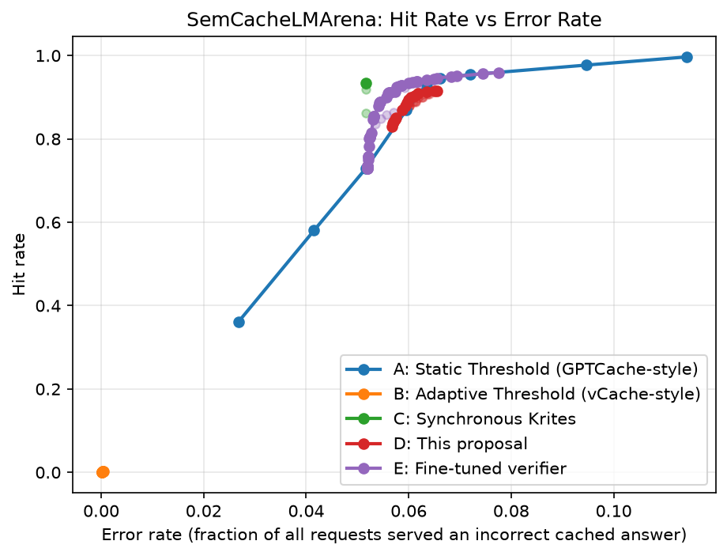

# 语义缓存中的同步在线验证门禁

**Chengyou Xin** · LoopDot AI Research · 2026-07-26

[English](README.md) | 简体中文

[](https://doi.org/10.5281/zenodo.21703365)

语义缓存用向量相似度替代精确匹配来复用大模型的历史回答,但相似度和答案正确性并非同一个量。这个仓库是一项实证研究的完整代码与实验产出,研究的问题很具体:在单层语义缓存架构下,用一个**真实**(非 oracle)、**同步**的验证器对缓存命中做门禁——在约 21 万条真实请求、三个数据集上,和静态阈值、自适应阈值两条基线做正式对比——到底能不能真正改善命中率与错误率之间的权衡?



**核心结论速览**

- **oracle 验证器**证明了这套机制确实有理论空间:在两个基准数据集上,相同错误率下命中率能提升 **20~28 个百分点**。
- 但换成一个**开箱即用**的现成 cross-encoder 验证器后,这个空间只兑现了很小、且不稳健的一部分——本文的 Go/No-Go 判定是**弱 Go**,不是无条件成立。
- **用数据集自己的灰色地带标签微调同一个验证器**,能在三个独立数据集上都补上大部分差距,包括把 SearchQueries 上一个**净损害**的验证器(AUC 0.60;见 [`PAPER.md`](PAPER.md) / [`PAPER_EN.md`](PAPER_EN.md) 文首勘误——早期版本曾报告 AUC 0.49,系一个已修正的数据缺陷所致)变成一个在 54 个测试点中 53 个跑赢静态阈值前沿、1 个打平、零落后的验证器(AUC 0.71)。
- 这套微调方案能容忍现实量级的标签噪声(约 30%)和冷启动,也扛住了真实生产客服流量的检验——但发现了**一个真实存在的反例**,并且追溯到了一个具体、可监控的原因,还做出了一个能提前发现这个风险的监控原型。

**阅读论文:** [`PAPER.md`](PAPER.md)(中文)· [`PAPER_EN.md`](PAPER_EN.md) · [`PAPER_EN.tex`](PAPER_EN.tex)(LaTeX 源码)

## 结果速览

| 数据集 | 开箱即用验证器(Group D) | 领域内微调验证器(Group E) |
|---|---|---|
| LmArena(对话式) | AUC 0.72 · 最佳可复现净收益约 **+1.9 个百分点**命中率 | AUC **0.88** · 几乎在所有测试点上跑赢静态阈值前沿 |
| SearchQueries(短关键词) | AUC 0.60 · **净损害**(36个测试点中23个输给静态阈值) | AUC **0.71** · 54 个测试点中 53 个跑赢,1个打平,零落后 |
| Quora(复述问题对) | —(不在原始 benchmark 内) | 以更小幅度复现同样的模式;从未比未微调基线更差 |

Oracle 理论上限(机制本身的上界,两个基准数据集均适用):相同错误率下命中率 **+20~28 个百分点**。完整数字、置信区间,以及四项进一步的稳健性消融实验(噪声、冷启动、漂移、真实生产流量),见论文第 5 节。

## 仓库结构

| 路径 | 内容 |
|---|---|
| `cacheverifier/` | 缓存策略(静态/自适应/同步验证)、embedding 模型、验证器、指标、实验运行器 |
| `scripts/` | 论文中提到的数据集转换、微调、漂移监控、绘图脚本 |
| `configs/` | 各数据集的 YAML 配置(LmArena、SearchQueries、Quora、Twitter Amazon/Comcast) |
| `results/` | 论文里报告的全部指标(JSON)和图表(PNG);两个微调验证器 checkpoint 托管在 Hugging Face,没有直接放进这个仓库,见 [`results/PRETRAINED_MODELS.md`](results/PRETRAINED_MODELS.md) |
| `tests/` | `cacheverifier/` 的单元测试 |

## 复现步骤

```bash
python3 -m venv .venv && .venv/bin/pip install -r requirements.txt
# 验证器微调 / cross-encoder 实验需要更重的依赖:
.venv/bin/pip install -r requirements-embeddings.txt

.venv/bin/pytest tests/ -q
```

原始数据集没有直接放进这个仓库(见 `.gitignore` 里的 `data/`)——`scripts/convert_*.py` 会从论文 §4.1 引用的公开数据源(HuggingFace `vCache/SemBenchmarkLmArena` / `SemBenchmarkSearchQueries`、Quora Question Pairs、Twitter 客服语料)重新生成。之后每个 `configs/*.yaml` 驱动 `cacheverifier/experiments/run_baselines.py`(A/B 组)和 `run_verified.py`(C/D 组)跑对应数据集。

## 微调模型

Group E 的微调验证器托管在 Hugging Face Hub,不在这个仓库里——见 [`results/PRETRAINED_MODELS.md`](results/PRETRAINED_MODELS.md)。

## 引用

已经在 Zenodo 存档,DOI: [10.5281/zenodo.21703365](https://doi.org/10.5281/zenodo.21703365)。arXiv 链接即将发布,届时会更新这里的引用信息。

```bibtex
@misc{xin2026synchronous,
  title  = {Synchronous Online Verification Gating in Semantic Caches: An Empirical Study},
  author = {Xin, Chengyou},
  year   = {2026},
  note   = {LoopDot AI Research},
  url    = {https://github.com/imxinchengyou/CacheVerifier},
  doi    = {10.5281/zenodo.21703365}
}
```

## 致谢

Group A/B 直接建立在 **vCache** 项目(L. G. Schroeder、A. Desai、A. Cuadron、K. Chu、S. Liu、M. Zhao、S. Krusche、A. Kemper、I. Stoica、M. Zaharia、J. E. Gonzalez)公开的 benchmark 和参考代码之上——SemCacheLmArena/SemCacheSearchQueries 数据集、静态阈值网格,以及本文逐行复刻的 `VerifiedDecisionPolicy`。5.6 节和 5.8 节还直接建立在 **Quora Question Pairs**(Iyer, Dandekar, & Csernai, 2017)和 Kaggle **"Customer Support on Twitter"**(Axelbrooke, 2017)数据集之上。完整致谢见论文正文。

## 许可

**保留所有权利** —— 见 [`LICENSE`](LICENSE)。这个仓库公开是为了支持论文结果的可复现性,不授予任何复制、修改或再分发的权利。